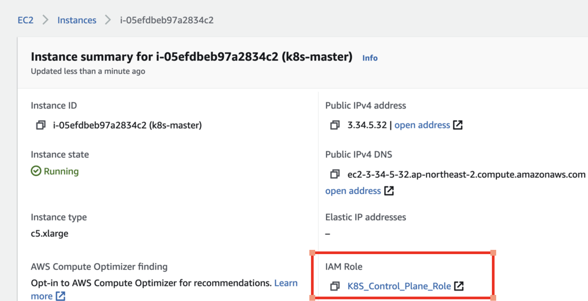
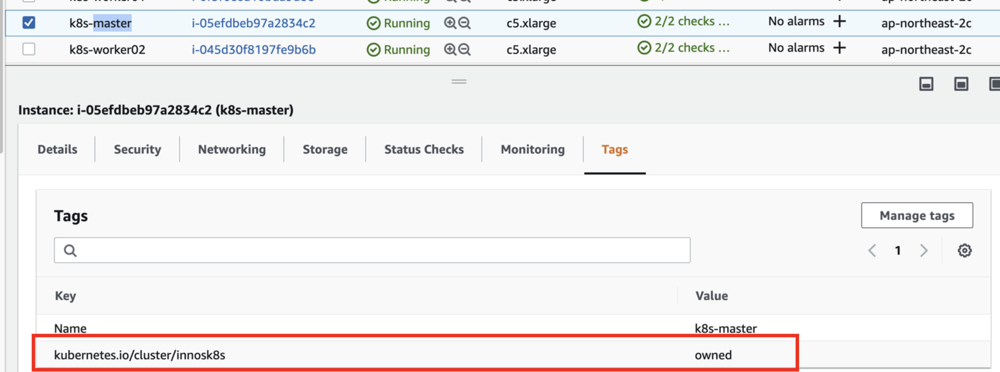
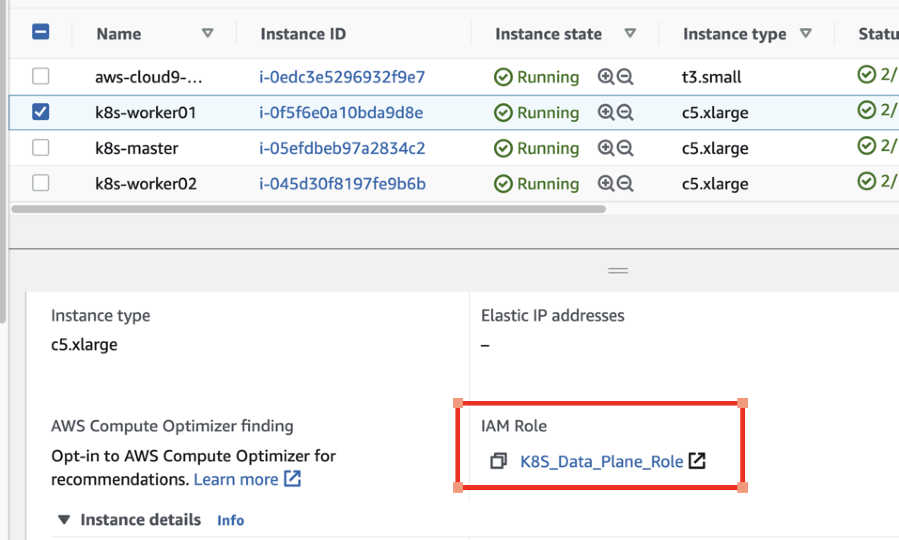
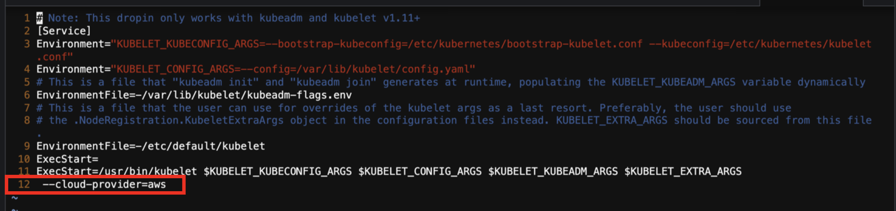

# 0. Single Master version with cloud controller manager

# kubeadm을 사용해 AWS EC2 Instance에서 kubernetes 클러스터 생성하기

> 1 단계 : 반복적으로 클러스터를 생성할 수 있도록, 명령어를 정리한다.  
> 2 단계 : Cloudformation으로 자동 생성하도록 한다.
   

# 1. VPC, Subnet, IGW, Security Group

## 1.1 VPC 만들기 
```bash

# VPC 현황 파악
aws ec2 describe-vpcs

# VPC 생성
export VPC_ID=$(aws ec2 create-vpc \
  --cidr-block 10.1.0.0/16 \
  --output text \
  --query 'Vpc.VpcId')

echo ${VPC_ID}
vpc-********

# VPC Tagging
aws ec2 create-tags \
  --resource ${VPC_ID} \
  --tags Key=Name,Value=k8s-by-kubeadm

# VPC dns enable
aws ec2 modify-vpc-attribute \
  --vpc-id ${VPC_ID} \
  --enable-dns-hostnames '{"Value": true}'
```

## 1.2 Subnet 만들기
```bash

export SUBNET_ID=$(aws ec2 create-subnet \
  --vpc-id ${VPC_ID} \
  --availability-zone ap-northeast-2c \
  --cidr-block 10.1.1.0/24 \
  --output text --query 'Subnet.SubnetId')

echo ${SUBNET_ID}
subnet-**********

aws ec2 create-tags \
  --resources ${SUBNET_ID} \
  --tags Key=Name,Value=k8s
```

## 1.3 Internet GateWay 생성

```bash
export INTERNET_GATEWAY_ID=$(aws ec2 create-internet-gateway \
  --output text \
  --query 'InternetGateway.InternetGatewayId')

echo ${INTERNET_GATEWAY_ID}
igw-********


aws ec2 create-tags \
  --resources ${INTERNET_GATEWAY_ID} \
  --tags Key=Name,Value=k8s


# 게이트웨이 연결
aws ec2 attach-internet-gateway \
  --internet-gateway-id ${INTERNET_GATEWAY_ID} \
  --vpc-id ${VPC_ID}


# 라우트 테이블 가져오기
export ROUTE_TABLE_ID=$(aws ec2 describe-route-tables \
  --filters Name=vpc-id,Values=${VPC_ID} \
  --output text \
  --query 'RouteTables[0].RouteTableId')

echo ${ROUTE_TABLE_ID}
rtb-*************

aws ec2 create-tags \
    --resources ${ROUTE_TABLE_ID} \
    --tags Key=Name,Value=k8s


aws ec2 associate-route-table \
  --route-table-id ${ROUTE_TABLE_ID} \
  --subnet-id ${SUBNET_ID}

aws ec2 create-route \
  --route-table-id ${ROUTE_TABLE_ID} \
  --destination-cidr-block 0.0.0.0/0 \
  --gateway-id ${INTERNET_GATEWAY_ID}


# 보안그룹 설정
export SECURITY_GROUP_ID=$(aws ec2 describe-security-groups \
  --filters Name=vpc-id,Values=${VPC_ID} \
  --output text \
  --query 'SecurityGroups[0].GroupId')


echo ${SECURITY_GROUP_ID}
sg-************

aws ec2 create-tags \
  --resources ${SECURITY_GROUP_ID} \
  --tags Key=Name,Value=k8s

# SSH
aws ec2 authorize-security-group-ingress \
  --group-id ${SECURITY_GROUP_ID} \
  --protocol tcp \
  --port 22 \
  --cidr 0.0.0.0/0;

# HTTPS
aws ec2 authorize-security-group-ingress \
  --group-id ${SECURITY_GROUP_ID} \
  --protocol tcp \
  --port 6443 \
  --cidr 0.0.0.0/0
```
---

# 2. EC2 Instnace 생성

## 2.1 Master Node 생성

```bash
#Ubuntu 18.04
export IMAGE_ID="ami-0e67aff698cb24c1d"

# ssh 용 key pair 생성
aws ec2 create-key-pair \
  --key-name k8s \
  --output text \
  --query 'KeyMaterial' > k8s.id_rsa

chmod 400 k8s.id_rsa

# Master용 EC2 생성
# c5.xlarge, hands on 용으로는  t3a.large(2vcpu), t3a.xlarge(4vcpu)
export MASTER_INSTANCE_ID=$(aws ec2 run-instances \
    --associate-public-ip-address \
    --image-id ${IMAGE_ID} \
    --count 1 \
    --key-name k8s \
    --security-group-ids ${SECURITY_GROUP_ID} \
    --instance-type c5.xlarge \
    --private-ip-address 10.1.1.10 \
    --user-data "name=master" \
    --subnet-id ${SUBNET_ID} \
    --output text --query 'Instances[].InstanceId')


aws ec2 create-tags \
  --resources ${MASTER_INSTANCE_ID} \
  --tags "Key=Name,Value=k8s-master"

# hostname set 
# 아래와 같이 Instance 의 Meta Data를 query해서 Host의 FQDN을 찾아 hostname으로 설정 한다. 
sudo hostnamectl set-hostname $(curl http://169.254.169.254/latest/meta-data/local-hostname)
```
<s># hostname set </s>  
<s>curl http://169.254.169.254/latest/meta-data/local-hostname </s>  
<s>ip-10-**-**-**.ap-northeast-2.compute.internal</s>  
<s># hostname 설정</s>  
<s>sudo hostnamectl set-hostname ip-10-**-**-**.ap-northeast-2.compute.internal</s>   


 ## 2.2 Woker Node 생성
```bash


# Worker Node용 EC2 생성 - Work Node #1 
export WORKER_INSTANCE_ID_1=$(aws ec2 run-instances \
    --associate-public-ip-address \
    --image-id ${IMAGE_ID} \
    --count 1 \
    --key-name k8s \
    --security-group-ids ${SECURITY_GROUP_ID} \
    --instance-type c5.xlarge \
    --private-ip-address 10.1.1.20 \
    --user-data "name=worker1" \
    --subnet-id ${SUBNET_ID} \
    --output text --query 'Instances[].InstanceId') 

aws ec2 create-tags \
  --resources ${WORKER_INSTANCE_ID_1} \
  --tags "Key=Name,Value=k8s-worker01"

# hostname 설정
sudo hostnamectl set-hostname $(curl http://169.254.169.254/latest/meta-data/local-hostname)


# Worker Node용 EC2 생성 - Work Node #2
export WORKER_INSTANCE_ID_2=$(aws ec2 run-instances \
    --associate-public-ip-address \
    --image-id ${IMAGE_ID} \
    --count 1 \
    --key-name k8s \
    --security-group-ids ${SECURITY_GROUP_ID} \
    --instance-type c5.xlarge \
    --private-ip-address 10.1.1.30 \
    --user-data "name=worker2" \
    --subnet-id ${SUBNET_ID} \
    --output text --query 'Instances[].InstanceId') 

aws ec2 create-tags \
  --resources ${WORKER_INSTANCE_ID_2} \
  --tags "Key=Name,Value=k8s-worker02"

# hostname 설정
sudo hostnamectl set-hostname $(curl http://169.254.169.254/latest/meta-data/local-hostname)

```
----

# 3. IAM Role 부여하기
 - EC2 Instance 에서 로드밸런서등을 프로비져닝 하기 위해서 Role을 부어해야 한다. 
 - Assume IAM Role to EC2 Instance

## 3.1 Master Node Policy
 - 아래와 같이 policy를 생성하고 EC2에 Role를 설정한다. 

```json
{
  "Version": "2012-10-17",
  "Statement": [
    {
      "Effect": "Allow",
      "Action": [
        "autoscaling:DescribeAutoScalingGroups",
        "autoscaling:DescribeLaunchConfigurations",
        "autoscaling:DescribeTags",
        "ec2:DescribeInstances",
        "ec2:DescribeRegions",
        "ec2:DescribeRouteTables",
        "ec2:DescribeSecurityGroups",
        "ec2:DescribeSubnets",
        "ec2:DescribeVolumes",
        "ec2:CreateSecurityGroup",
        "ec2:CreateTags",
        "ec2:CreateVolume",
        "ec2:ModifyInstanceAttribute",
        "ec2:ModifyVolume",
        "ec2:AttachVolume",
        "ec2:AuthorizeSecurityGroupIngress",
        "ec2:CreateRoute",
        "ec2:DeleteRoute",
        "ec2:DeleteSecurityGroup",
        "ec2:DeleteVolume",
        "ec2:DetachVolume",
        "ec2:RevokeSecurityGroupIngress",
        "ec2:DescribeVpcs",
        "elasticloadbalancing:AddTags",
        "elasticloadbalancing:AttachLoadBalancerToSubnets",
        "elasticloadbalancing:ApplySecurityGroupsToLoadBalancer",
        "elasticloadbalancing:CreateLoadBalancer",
        "elasticloadbalancing:CreateLoadBalancerPolicy",
        "elasticloadbalancing:CreateLoadBalancerListeners",
        "elasticloadbalancing:ConfigureHealthCheck",
        "elasticloadbalancing:DeleteLoadBalancer",
        "elasticloadbalancing:DeleteLoadBalancerListeners",
        "elasticloadbalancing:DescribeLoadBalancers",
        "elasticloadbalancing:DescribeLoadBalancerAttributes",
        "elasticloadbalancing:DetachLoadBalancerFromSubnets",
        "elasticloadbalancing:DeregisterInstancesFromLoadBalancer",
        "elasticloadbalancing:ModifyLoadBalancerAttributes",
        "elasticloadbalancing:RegisterInstancesWithLoadBalancer",
        "elasticloadbalancing:SetLoadBalancerPoliciesForBackendServer",
        "elasticloadbalancing:AddTags",
        "elasticloadbalancing:CreateListener",
        "elasticloadbalancing:CreateTargetGroup",
        "elasticloadbalancing:DeleteListener",
        "elasticloadbalancing:DeleteTargetGroup",
        "elasticloadbalancing:DescribeListeners",
        "elasticloadbalancing:DescribeLoadBalancerPolicies",
        "elasticloadbalancing:DescribeTargetGroups",
        "elasticloadbalancing:DescribeTargetHealth",
        "elasticloadbalancing:ModifyListener",
        "elasticloadbalancing:ModifyTargetGroup",
        "elasticloadbalancing:RegisterTargets",
        "elasticloadbalancing:DeregisterTargets",
        "elasticloadbalancing:SetLoadBalancerPoliciesOfListener",
        "iam:CreateServiceLinkedRole",
        "kms:DescribeKey"
      ],
      "Resource": [
        "*"
      ]
    }
  ]
}
```
 - 참고  



## 3.2 Add Tag

 - 각 Instance에 `kubernetes.io/cluster/<clustername>` 형식으로 Tag를 추가한다. 
 
 - 참고



## 3.3 Worker Node Policy 
```json
{
      "Version": "2012-10-17",
      "Statement": [
          {
              "Effect": "Allow",
              "Action": [
                  "ec2:DescribeInstances",
                  "ec2:DescribeRegions",
                  "ecr:GetAuthorizationToken",
                  "ecr:BatchCheckLayerAvailability",
                  "ecr:GetDownloadUrlForLayer",
                  "ecr:GetRepositoryPolicy",
                  "ecr:DescribeRepositories",
                  "ecr:ListImages",
                  "ecr:BatchGetImage"
              ],
              "Resource": "*"
          } 
      ]
  }

```
 - 참고   

## 3.4 Tag 추가
 - 위의 과정과 동일

 

------

# Kubeadm 설치 및 k8s cluster 설정


# 1. Kubeadm 설치 (Master, Worker 공통)
- 참조: https://kubernetes.io/docs/setup/production-environment/tools/kubeadm/install-kubeadm/
## 1.1 네트워크 설정 체크 
```bash
# MAC Address check & product_uuid
ip link
sudo cat /sys/class/dmi/id/product_uuid

#br_netfilter 모듈이 로딩된것 확인
$ lsmod | grep br_netfilter
br_netfilter           28672  0
bridge                176128  1 br_netfilter
#위의 명령에서 아무런 내용이 없으면 아래 명령어를 실행한다. 
sudo modprobe br_netfilter

# Node 의 iptable이 bridge traffice을 바라볼 수 있는지 확인
# net.bridge.bridge-nf-call-iptables 가 1로 설정되어야 함
cat <<EOF | sudo tee /etc/sysctl.d/k8s.conf
net.bridge.bridge-nf-call-ip6tables = 1
net.bridge.bridge-nf-call-iptables = 1
EOF
sudo sysctl --system

```

## 1.2 Diable swap
```bash
swapoff -a
sed -i.bak -r 's/(.+ swap .+)/#\1/' /etc/fstab
```

## 1.3 Install Docker

```bash
# install docker : https://docs.docker.com/engine/install/ubuntu/

## 1. Set Up the repository
sudo apt-get update

sudo apt-get install \
  apt-transport-https \
  ca-certificates \
  curl \
  gnupg-agent \
  software-properties-common

curl -fsSL https://download.docker.com/linux/ubuntu/gpg | sudo apt-key add -

sudo apt-key fingerprint 0EBFCD88

sudo add-apt-repository \
   "deb [arch=amd64] https://download.docker.com/linux/ubuntu \
   $(lsb_release -cs) \
   stable"

## 2. install docker
sudo apt-get update
sudo apt-get install docker-ce docker-ce-cli containerd.io

## 3. add user to docker group
sudo usermod -aG docker $USER

## 4. remember to log out and back in for this to take effect
## 로그아웃 했다가 다시 접속한다. 

## docker cgroup drive substitute `cgroup` with `systemd`

cat > /etc/docker/daemon.json <<EOF
{
  "exec-opts": ["native.cgroupdriver=systemd"],
  "log-driver": "json-file",
  "log-opts": {
    "max-size": "100m"
  },
  "storage-driver": "overlay2"
}
EOF

sudo systemctl restart docker
sudo systemctl enable docker
```


## 1.4 kubeadm, kubelet, kubectl 설치

```bash
sudo apt-get update && sudo apt-get install -y apt-transport-https curl
curl -s https://packages.cloud.google.com/apt/doc/apt-key.gpg | sudo apt-key add -
cat <<EOF | sudo tee /etc/apt/sources.list.d/kubernetes.list
deb https://apt.kubernetes.io/ kubernetes-xenial main
EOF
sudo apt-get update
sudo apt-get install -y kubelet kubeadm kubectl
sudo apt-mark hold kubelet kubeadm kubectl
```


# 2. Mater Node 구성

## 2.1 kubeadm init으로 Master Node 구성


### Create a `/etc/kubernetes/aws.yaml` file
 - service Subnet을 설정하지 않으면 `10.96.0.0/12` 이 설정된다.  

```yaml
---
apiVersion: kubeadm.k8s.io/v1beta2
kind: ClusterConfiguration
networking:
  serviceSubnet: "10.100.0.0/16"
  podSubnet: "10.244.0.0/16"
apiServer:
  certSANs:
  - 10.1.1.10
  - 3.34.5.32
  extraArgs:
    cloud-provider: "aws"
controllerManager:
  extraArgs:
    cloud-provider: "aws"
```
- kubelet 설정 파일(`/etc/systemd/system/kubelet.service.d/10-kubeadm.conf`)에 aws 환경을 알린다. 
```bash
  --cloud-provider=aws
```


```bash
systemclt daemon-reload
```


### k8s control plane bootstrapping

```bash
sudo kubeadm init --config /etc/kubernetes/aws.yaml
```


## 2.2 kubectl config 설정
```bash
# 설치에 성공하면 아래와 같은 성공 메세지가 나온다. 
Your Kubernetes control-plane has initialized successfully!


# 1) Master에  kubectl 설정
  mkdir -p $HOME/.kube
  sudo cp -i /etc/kubernetes/admin.conf $HOME/.kube/config
  sudo chown $(id -u):$(id -g) $HOME/.kube/config

# 2) Master Node에 Network Addon 설치 : Flannel 설치
kubectl apply -f https://raw.githubusercontent.com/coreos/flannel/master/Documentation/kube-flannel.yml

# 3) 각 Worker Node에서 join 할때 사용한 명령어 
sudo kubeadm join 10.1.1.10:6443 --token ozymu1.hp4j0l6zxr706ik3 \
    --discovery-token-ca-cert-hash sha256:390f862e43c4db7fae19287c522b8a63ca76184133e04f66bba00c879b5845a2

```


# 3. Worker Node 구성
 - 위의 [1. Kubeadm 설치 (Master, Worker 공통](#1.-Kubeadm-설치-(Master,-Worker-공통)) 를 따라서 설정
```bash
#접속
ssh -i k8s.id_rsa ubuntu@13.125.237.228
```

## 3.1 Kubeadm 설치 및 설정
 -  [1. Kubeadm 설치 (Master, Worker 공통)](#1.-Kubeadm-설치-(Master,-Worker-공통)) 를 따라서 설정

## 3.2 Join Cluster 
```bash
# 위의 과정이 끝나면 아래 명령어로 클러스터에 조인한다. 
sudo kubeadm join 10.1.1.10:6443 --token ozymu1.hp4j0l6zxr706ik3 \
    --discovery-token-ca-cert-hash sha256:390f862e43c4db7fae19287c522b8a63ca76184133e04f66bba00c879b5845a2

```


## 3.4 Test

- deployment & service 를 생성해서 ELB 의 생성을 확인 한다. 
```yaml
kind: Service
apiVersion: v1
metadata:
  name: hello
spec:
  type: LoadBalancer
  selector:
    app: hello
  ports:
    - name: http
      protocol: TCP
      # ELB's port
      port: 80
---
apiVersion: apps/v1
kind: Deployment
metadata:
  name: hello
spec:
  replicas: 1
  selector:
    matchLabels:
      app: hello
  template:
    metadata:
      labels:
        app: hello
    spec:
      containers:
        - name: hello
          image: nginx
```
```bash
kubectl apply -f elb-example.yml

kubectl get deploy -o wide
kubectl get rs -o wide
kubectl get pod -o wide
kubectl get svc -o wide


```


## 3.5 EBS 사용을 위한 AWS Storage Class

```bash
kubectl apply -f https://raw.githubusercontent.com/kubernetes/kubernetes/master/cluster/addons/storage-class/aws/default.yaml
```


# 4. Reset and clean up
Cluster를 초기 상태로 돌리기 위해서는 각 노드별로 아래 명령을 수행한다.

```bash
sudo kubeadm reset

#The reset process does not clean CNI configuration. To do so, you must remove /etc/cni/net.d
sudo rm -R /etc/cni/net.d

# sudo -s (to root)
iptables -F && iptables -t nat -F && iptables -t mangle -F && iptables -X
```

-----

## 이하 참조


### Firewall   


### Check required ports 

***Control-plane node(s)***
|Protocol|Direction|Port Range|Purpose|Used By|
|--------|---------|---------|-------|-------|
|TCP|Inbound|6443*|Kubernetes API server|All|
|TCP|Inbound|2379-2380|etcd server client API	|kube-apiserver, etcd|
|TCP|Inbound|	10250|	Kubelet API	|Self, Control plane|
|TCP|Inbound|	10251|	kube-scheduler	|Self|
|TCP|Inbound|	10252|	kube-controller-manager|	Self|


***Worker node(s)***
|Protocol|	Direction|	Port Range|	Purpose|	Used By|
|--------|-----------|------------|---------|---------|
|TCP	|Inbound	|10250	|Kubelet API	|Self, Control plane|
|TCP	|Inbound	|30000-32767	|NodePort Services†|	All|

# Ubuntu의 경우는 기본 firewall이 ufw(Uncomplicated Firewall) 이므로 
```bash
sudo ufw enable

sudo ufw allow proto tcp 6443,2379,2380,10250,10251,10252


```


```bash
# .vimrc
set et
set ts=2
set sw=2
set nu

# .bashrc
alias k='kubectl'
source <(k completion bash) # auto completion enable
complete -F __start_kubectl k # auto completion with command 'k'

```

## 참조 
 - [Installing kubeadm-official Doc](https://kubernetes.io/docs/setup/production-environment/tools/kubeadm/install-kubeadm/)
 - [Setup a Kubernetes Cluster on AWS EC2 Instance with Ubuntu using kubeadm](https://www.howtoforge.com/setup-a-kubernetes-cluster-on-aws-ec2-instance-ubuntu-using-kubeadm/)
 - [AWS EC2에서 kubeadm으로 쿠버네티스 클러스터 만들기 - (1) AWS 인프라 구축](https://jonnung.dev/kubernetes/2020/03/01/create-kubernetes-cluster-using-kubeadm-on-aws-ec2/)
  - [Deploy Kubernetes on AWS - Multi Master](https://theithollow.com/2020/01/13/deploy-kubernetes-on-aws/)
    - Mutli Master 구조
  - [Kubernetes: part 2 — a cluster set up on AWS with AWS cloud-provider and AWS LoadBalancer](https://itnext.io/kubernetes-part-2-a-cluster-set-up-on-aws-with-aws-cloud-provider-and-aws-loadbalancer-f02c3509f2c2)
  - [쿠버네티스(kubernetes) 설치 및 환경 구성하기 - 친절한 한글 설명](https://medium.com/finda-tech/overview-8d169b2a54ff)
