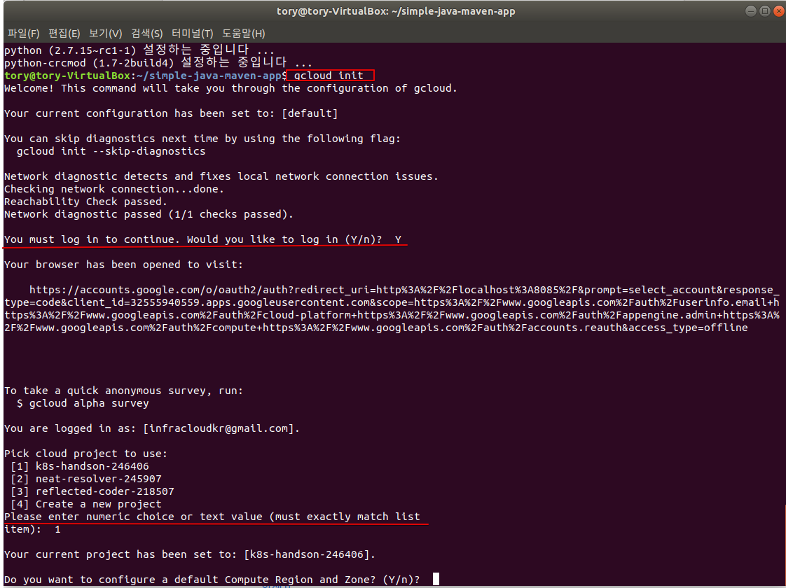

## gcloud SDK 설치

google의 Managed kubernetes Service은 Google Kuberentes Engine을 사용하기 위해서 아래와 같이 입력한다. 

```shell

# Create environment variable for correct distribution
export CLOUD_SDK_REPO="cloud-sdk-$(lsb_release -c -s)"

# Add the Cloud SDK distribution URI as a package source
echo "deb http://packages.cloud.google.com/apt $CLOUD_SDK_REPO main" | sudo tee -a /etc/apt/sources.list.d/google-cloud-sdk.list

# Import the Google Cloud Platform public key
curl https://packages.cloud.google.com/apt/doc/apt-key.gpg | sudo apt-key add -

# Update the package list and install the Cloud SDK
sudo apt-get update && sudo apt-get install google-cloud-sdk

```

## SDK 초기화
```shell
$ gcloud init

```



### SDK 설치 확인
```shell
$ gcloud config list
#설정 내용 확인
$ gcloud info

```


```shell
$ gcloud container clusters list 

$ gcloud container clusters get-credentials <name> --region=<region-name>
```


```shell
#클러스터 확인 
$ kubectl cluster-info
```


### 참조 : https://cloud.google.com/sdk/docs/quickstart-debian-ubuntu?authuser=2&hl=ko

### 실습 예제 clone


```
$ git clone https://github.com/DannyKang/k8s-Workshop.git
```