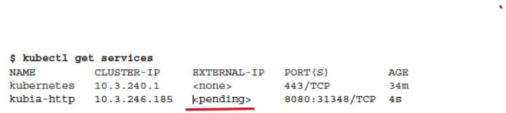
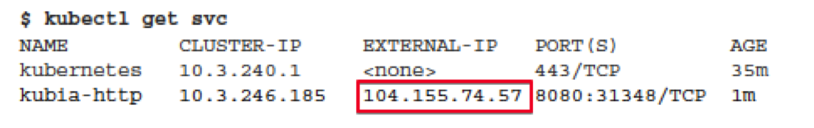
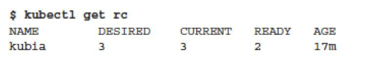
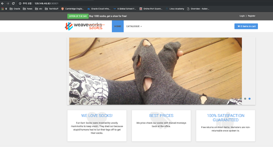
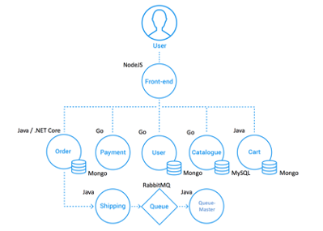

### 1. Kubernetes Cluster 만들기
쿠버네티스 클러스트는 만드는 방법을 다양하나 이번 실습에서는 AWS Elastic Kubernetes Service를 이용한다. 

### 1.1 계정 및 Trial 신청
각 조별로 조장이 공유하는 Cloud9에서 k8s 클러스터를 사용한다. 


 - Cluster infomation
Cloud9에서 클러스터 정보 확인
 ```bash
 # cluster 정보 조회
 $ kubectl cluster-info  

 # node 정보 조회
$ kubectl get node
 ```
 
 ``` shell
$ kubectl describe node <nodename>  
# ex) kubectl describe node gke-standard-cluster-1-default-pool-872025dc-4rch
 ```


 -  Tab Completion in bash (optional)
```
 $ source <(kubectl completion bash)
```
 - Application 실행
```
$ kubectl run kubia --image=luksa/kubia --port=8080 --generator=run/v1
```

 - 실행 Pod 확인
 
```bash
$ kubectl get pod
```


 - 서비스 생성
```bash
$ kubectl expose rc kubia --type=LoadBalancer --name kubia-http
```

- 서비스 상태 확인 
처음에 Pend이었다가 External-IP가 할당되는 것을 확인할 수 있다. (계속 "kubectl get svc"를 실행해서 상태 변경확인)





```bash
#LoadBalancer Provision에 시작이 좀 걸린다. 중간에 아래 명령을 통해서 상태를 확인 하자
$ kubectl describe svc kubia-http

kubectl get svc --all-namespaces --context arn:aws:eks:ap-northeast-2:715981741253:cluster/aws-cluster
NAMESPACE      NAME                    TYPE           CLUSTER-IP       EXTERNAL-IP                                                                          PORT(S)                                                                       AGE
istio-system   istio-ingressgateway    LoadBalancer   172.20.220.251   a1d0ff711136d4275b85e394780158bb-1911545481.ap-northeast-2.elb.amazonaws.com         15021:32078/TCP,80:31717/TCP,443:30883/TCP,15443:30662/TCP                    24d
istio-system   istiod                  LoadBalancer   172.20.220.234   a76e286c2b6994c66b478272e33dc506-a3a6941e3f147d97.elb.ap-northeast-2.amazonaws.com   15010:30101/TCP,15012:32697/TCP,443:30009/TCP,15014:30925/TCP,853:32555/TCP   24d
kube-system    kube-dns                ClusterIP      172.20.0.10      <none>                                                                               53/UDP,53/TCP                                                                 27d
sample         helloworld              ClusterIP      172.20.68.180    <none>                                                                               5000/TCP                                                                      24d
sample         sleep                   ClusterIP      172.20.10.36     <none>                                                                               80/TCP                                                                        24d

# EXTERNAL-IP : a1d0ff711136d4275b85e394780158bb-1911545481.ap-northeast-2.elb.amazonaws.com    
```

- 서비스 접속 확인
```
$curl a1d0ff711136d4275b85e394780158bb-1911545481.ap-northeast-2.elb.amazonaws.com    :8080
```
- ReplicationController 확인 및 Scale Out
Replication Controller는 Pod를 복제하도록 하는 컨트롤러이다. 

```
$ kubectl get replicationcontrollers
```

현재는 `Desired=1` 와 `Current=1` 상태이다. 

여기에 kubia pod를 3개로 늘려본다. 
```
$ kubectl scale rc kubia --replicas=3
```


 - Scale out 확인

```
$ kubectl get rc
```


Replication Controller 의 `Desired` 와 `Current`를 확인한다.

```
$ kubectl get pods
```

Pod가 Deploy되는 상태(`STATE`)를 관찰한다. 


```
$ kubectl get all
```
- 서비스 접속 확인  


## 4. kubectl config 설정 

```bash
# 클러스터 정보 확인
$ kubectl cluster-info

# 현재 컨텍스트 보기 및 설정 보기
$ kubectl config current-context

$ kubectl config view
```

 -  Tab Completion in bash (optional)
```
 $ source <(kubectl completion bash)
```


## 5. Kube Ops View 설치


```bash
#helm CLI install
curl -sSL https://raw.githubusercontent.com/helm/helm/master/scripts/get-helm-3 | bash

helm version --short

helm repo add stable https://charts.helm.sh/stable

helm search repo stable


# kube-ops-view install
helm install kube-ops-view \
stable/kube-ops-view \
--set service.type=LoadBalancer \
--set rbac.create=True

helm list
NAME            REVISION        UPDATED                         STATUS          CHART                   APP VERSION     NAMESPACE
kube-ops-view   1               Sun Sep 22 11:47:31 2019        DEPLOYED        kube-ops-view-1.1.0     0.11            default

# service URL 
kubectl get svc kube-ops-view | tail -n 1 | awk '{ print "Kube-ops-view URL = http://"$4 }'

```


## 6. Sock Shop





 - Sock Shop 설치
```bash
git clone https://github.com/microservices-demo/microservices-demo
cd microservices-demo

kubectl create namespace sock-shop

kubectl apply -f complete-demo.yaml
```