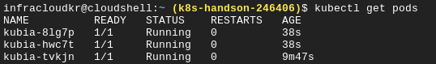
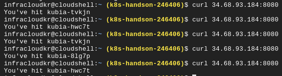
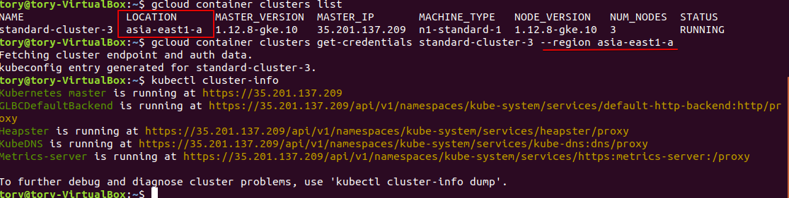

# Docker  실습

## Pre-Requisite

 1. 본 실습은 local의 minikube와 google 의 kubernetes engine을 사용합니다. 
   본 교육 이후에도 살습환경을 유지하고 싶으신 분들 구글 계정(gmail 계정)을 가지고 [링크](https://console.cloud.google.com/)로 접속해 Free Trial을 신청한다. 
 2 . Trial 신청을 하지 않으신 분들은  google cloud를 사용하기 위해 수강생의 gmail 계정에서 innoshome@gmail.com으로 메일 발송하면, 회신 메일로 `Google Developers Console 프로젝트 초대` 링크 발송
 3. Virtual Box의 Ubuntu에서 Login   
    ID: tory PWD: admin

## 1. Docker를 이용한 Hello World 애플리케이션 

첫번째 애플리케이션으로 echo로 `Hello World`를 반환하는 도커를 실행

Virtual Box의  Terminal에서 아래를 명령어 입력 

```bash
# 첫번째 docker 애플리케이션 실행
$ docker run busybox echo "Hello World"
Unable to find image 'busybox:latest' locally
latest: Pulling from docker.io/busybox
9a163e0b8d13: Pull complete
fef924a0204a: Pull complete
Digest: sha256:97473e34e311e6c1b3f61f2a721d038d1e5eef17d98d1353a513007cf46ca6bd
Status: Downloaded newer image for docker.io/busybox:latest
Hello world
```


### 2. Node.js 애플리케이션 Dockerize

#### 2.1 애플리케이션 생성
아래의 소스 코드를 app.js로 저장한다. 
> Virtual Box 내에 "/home/tory/k8s-workshop/chapter1/app.js"이 있음
```javascript
const http = require('http');
const os = require('os');
console.log("Kubia server starting...");
var handler = function(request, response) {
console.log("Received request from " + request.connection.remoteAddress);
response.writeHead(200);
response.end("You've hit " + os.hostname() + "\n");
};
var www = http.createServer(handler);
www.listen(8080);
```
 
#### 2.2 Dockerfile 생성
도커는 Dockerfile을 이용해서 Docker Image를 생성할 수 있다. 

아래 파일을 "Dockerfile"로 생성
>/home/tory/k8s-workshop/chapter1/Dockerfile

```javascript
FROM node:7
ADD app.js /app.js
ENTRYPOINT ["node", "app.js"]
```
Docker hub 에서 node image를 가져와서 현재 Directory의 app.js를 Docker image의 `/app.js`에 추가하고, 실행시에 node로 app.js를 실행한다. 


#### 2.3 image build & 확인
Dockerfile이 있는 폴더에서 아래 명령 실행

```shell
$ docker build -t kubia .
```

이미지 확인
```
$ docker images
REPOSITORY TAG IMAGE ID CREATED VIRTUAL SIZE
kubia latest d30ecc7419e7 1 minute ago 637.1 MB
...
```

#### 2.4 컨테이너 이미지 실행

- 컨테이너 실행
```bash
# 도서 실행 docekr run
$ docker run --name kubia-container -p 8080:8080 -d kubia
```

 - 서비스 확인 
```
 $ curl localhost:8080 
 You’ve hit 44d76963e8e1
```

- 실행중인 컨테이너 listing
```
$ docker ps
CONTAINER ID IMAGE COMMAND CREATED ...
44d76963e8e1 kubia:latest "/bin/sh -c 'node ap 6 minutes ago ...
... STATUS PORTS NAMES
... Up 6 minutes 0.0.0.0:8080->8080/tcp kubia-container
```
 - container의 추가 정보 확인 
```
$ docker inspect kubia-container

```
#### 2.5 컨테이너 내부 접속

```
$ docker exec -it kubia-container bash
```
-i : interactive, -t : allocate a pseudo terminal(tty)

 - 컨테이너 내부 프로세스
```bash
#위의 docker exec -it 로 접속해서 bash를 실행한 상태
root@44d76963e8e1:/# ps aux
USER PID %CPU %MEM VSZ RSS TTY STAT START TIME COMMAND
root 1 0.0 0.1 676380 16504 ? Sl 12:31 0:00 node app.js
root 10 0.0 0.0 20216 1924 ? Ss 12:31 0:00 bash
root 19 0.0 0.0 17492 1136 ? R+ 12:38 0:00 ps aux
```
위의 app.js 의 PID 주목 
 - 호스트 OS에서의 컨테이너 프로세스
``` 
$ ps aux | grep app.js
USER PID %CPU %MEM VSZ RSS TTY STAT START TIME COMMAND
root 382 0.0 0.1 676380 16504 ? Sl 12:31 0:00 node app.js
```
위의 컨테이너의 PID와 호스트의 PID가 다른것을 확인할 수 있다.
컨테이너는 호스트와 별도의 PID Namespace를 가진다. 

- 컨테이너내의 파일 시스템도 호스트 OS와 격리된 파일시스템을 갖는다. 
```
root@44d76963e8e1:/# ls /
app.js boot etc lib media opt root sbin sys usr
bin dev home lib64 mnt proc run srv tmp var
```
#### 2.6 컨테이너 중지

```
$ docker stop kubia-container
```

#### 2.7 컨테이너 이미지 push하기

Container Image를 Local Machine이외에 외부의 다양한 곳에서 사용하 위해서는 Image Registry(ex: Docker Hub, Quary.io, Google Container Registry 등)에 저장해야 한다.  Docker에서 제공하는 Docker Hub를 이용하기 위해서 http://hub.docker.com에 접속해서 계정을 생성한다. 

 - 이미지 tagging
```
 $ docker tag kubia <your-docker-hub-account>/kubia
```
ex: $ docker tag kubia luksa/kubia

 - docker hub login

``` bash
#docker hub 계정을 이용해서 로그인 한다.
$ docker login
Username: exampleuser
Password:
Email: exampleuser@example.com
Login Succeeded
```

 - 이미지 push
```
$ docker push <your-docker-hub-account>/kubia
```
 - 컨테이너 실행
```
$ docker run -p 8080:8080 -d <your-docker-hub-account>/kubia
```

### 3. Kubernetes Cluster 만들기
쿠버네티스 클러스트는 만드는 방법을 다양하나 이번 실습에서는 Google Kubernetes Engine을 이용한다. 

### 3.1 계정 및 Trial 신청
innoshome@gmail.com로 메일을 보내신 분들은 아래 그림과 같이 각자의 gmail 계정으로 프로젝트 초대 메일의 링크를 통해 접속한다. Trial을 신청하신 분들은 본인의 계정으로 [링크](https://console.cloud.google.com/)에 접속한다.  


 - Kubernetes Engine 클러스터 만들기

 
 
 #### 클러스터 설정
  - 표준 클러스터, 노드수 3EA

 - 콘솔 연결


 - Cloud Shell 에서 실행 


 - Cluster infomation
 위의 `Cloud Shell 시작`을 클릭하면 화면 하단에 Linux Debian OS의 shell이 활성화 되어 있다. 


 ```bash
 # cluster 정보 조회
 $ kubectl cluster-info  

 # node 정보 조회
$ kubectl get node
 ```
 
 ``` shell
$ kubectl describe node <nodename>  
# ex) kubectl describe node gke-standard-cluster-1-default-pool-872025dc-4rch
 ```
 

 -  Tab Completion in bash (optional)
```
 $ source <(kubectl completion bash)
```
 - Application 실행
```
$ kubectl run kubia --image=luksa/kubia --port=8080 --generator=run/v1
```
```bash

 - 실행 Pod 확인
$ kubectl get pod


 - 서비스 생성
$ kubectl expose rc kubia --type=LoadBalancer --name kubia-http

- 서비스 상태 확인 
처음에 Pend이었다가 External-IP가 할당되는 것을 확인할 수 있다. (계속 "kubectl get svc"를 실행해서 상태 변경확인)


```bash
#LoadBalancer Provision에 시작이 좀 걸린다. 중간에 아래 명령을 통해서 상태를 확인 하자
$ kubectl describe svc kubia-http
```


- 서비스 접속 확인
```
$curl 104.155.xx.xx:8080
```
- ReplicationController 확인 및 Scale Out
Replication Controller는 Pod를 복제하도록 하는 컨트롤러이다. 

```
$ kubectl get replicationcontrollers
```

현재는 `Desired=1` 와 `Current=1` 상태이다. 

여기에 kubia pod를 3개로 늘려본다. 
```
$ kubectl scale rc kubia --replicas=3
```


 - Scale out 확인

```
$ kubectl get rc
```


Replication Controller 의 `Desired` 와 `Current`를 확인한다.

```
$ kubectl get pods
```

Pod가 Deploy되는 상태(`STATE`)를 관찰한다. 



```
$ kubectl get all
```
- 서비스 접속 확인  


## 4. kubectl config 설정 
앞으로 있을 실습을 좀 더 원활하게 하기 위해서 Virtual Box내에 kubectl의 설정을 아래와 같이 한다.

```bash
# 현재 k8s cluster 정보 확인
$ gcloud container cluster list
```
 - cluster의 Region을 참조하여 클러스터 엔드포인트 정보 가져오기 


```bash
#클러스트 엔드포인트 정보 가져오기 
$ gcloud container clusters get-credentials [cluster-name] --region [region]

# 클러스터 정보 확인
$ kubectl cluster-info

# 현재 컨텍스트 보기 및 설정 보기
$ kubectl config current-context

$ kubectl config view
```

 -  Tab Completion in bash (optional)
```
 $ source <(kubectl completion bash)
```