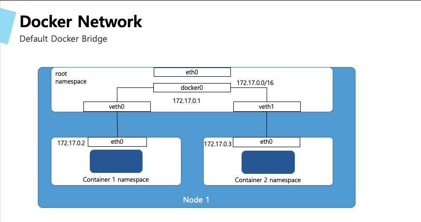

# Docker  실습

## Pre-Requisite

 1. Cloud 9 으로 접근하기 


## 0. Docker 설치 확인 
Cloud9 Terminal에서 아래를 명령어 입력 

```bash
# docver version 확인
$ docker version
Client:
 Version:           19.03.6-ce
 API version:       1.40
 OS/Arch:           linux/amd64


Server:
 Engine:
  Version:          19.03.6-ce
  API version:      1.40 (minimum version 1.12)
  Built:            Fri May 29 04:01:57 2020
  OS/Arch:          linux/amd64
  Experimental:     false
# Containerd, runc, docker-init
 containerd:
  Version:          1.3.2
  GitCommit:        ff48f57fc83a8c44cf4ad5d672424a98ba37ded6
 runc:
  Version:          1.0.0-rc10
  GitCommit:        dc9208a3303feef5b3839f4323d9beb36df0a9dd
 docker-init:
  Version:          0.18.0
  GitCommit:        fec3683

# Quiz : Containerd와 RunC의 차이점을 설명 ? 

# docker 정보 확인
$ docker info
Client:
 Debug Mode: false

Server:
 Containers: 3
  Running: 1
  Paused: 0
  Stopped: 2
 Images: 12
 Server Version: 19.03.6-ce
 #Storage Driver
 Storage Driver: overlay2
  Backing Filesystem: xfs
  Supports d_type: true
  Native Overlay Diff: true
 Logging Driver: json-file
 Cgroup Driver: cgroupfs
 Plugins:
  Volume: local
  Network: bridge host ipvlan macvlan null overlay
  Log: awslogs fluentd gcplogs gelf journald json-file local logentries splunk syslog
 Swarm: inactive
 #Runtimes: runc
 Runtimes: runc
 Default Runtime: runc
 Init Binary: docker-init
 containerd version: ff48f57fc83a8c44cf4ad5d672424a98ba37ded6
 runc version: dc9208a3303feef5b3839f4323d9beb36df0a9dd
 init version: fec3683
 Security Options:
  seccomp
   Profile: default
 Kernel Version: 4.14.200-155.322.amzn2.x86_64
 Operating System: Amazon Linux 2
 OSType: linux
 Architecture: x86_64
 CPUs: 2
 Total Memory: 1.909GiB
 Name: ip-172-31-41-205.ap-northeast-2.compute.internal
 ID: L4NV:OQJI:4H35:EXOV:5EM5:6NA2:ZEXR:X523:VKWE:IU26:R6MP:GKDA
 #Docker Root Dir
 Docker Root Dir: /var/lib/docker
 Debug Mode: false
 Registry: https://index.docker.io/v1/
 Labels:
 Experimental: false
 Insecure Registries:
  127.0.0.0/8
 Live Restore Enabled: false
 ```


## 1. Docker를 이용한 Hello World 애플리케이션 

첫번째 애플리케이션으로 echo로 `Hello World`를 반환하는 도커를 실행

Cloud9 Terminal에서 아래를 명령어 입력 

```bash

#1.1 첫번째 docker 애플리케이션 실행
$ docker run busybox echo "Hello World"
Unable to find image 'busybox:latest' locally
latest: Pulling from docker.io/busybox
9a163e0b8d13: Pull complete
fef924a0204a: Pull complete
Digest: sha256:97473e34e311e6c1b3f61f2a721d038d1e5eef17d98d1353a513007cf46ca6bd
Status: Downloaded newer image for docker.io/busybox:latest
Hello world

#1.2 container 내부 shell 수행
# container는 주 프로세스가 실행되는 동안에만 동작한다.  
# 아래 예제에서는 shell을 빠져나오면 실행을 멈춘다. 
$ docker run -i -t busybox /bin/sh
/ # ls
bin   dev   etc   home  proc  root  sys   tmp   usr   var
/ # echo "hello"
hello
/ # exit


# 1.4 # 컨테이너가 실행된 이후 변경된 파일의 목록
$ docker run -i -t busybox /bin/sh
/
docker diff <container_name>

# 도커 실행
$ docker run -i -t busybox /bin/sh                                                                                                                                             
/ # touch test.txt
/ # 

# 컨테이너 ID 참조
# --name으로 이름을 정의하지 않으면 <임의의형용사>_<유명과학자, 엔지니어, 해커이름> 형태로 이름이 주어진다.
# STATUS, NAMES 확인
$ docker ps -a
CONTAINER ID        IMAGE               COMMAND                  CREATED             STATUS                     PORTS                    NAMES
3e472fa4e9f8        busybox             "/bin/sh"                19 seconds ago      Up 18 seconds                                       mystifying_chatterjee
58078ee5d5d8        busybox             "/bin/sh"                8 minutes ago       Exited (0) 6 minutes ago                            elegant_brahmagupta
3008eb0bc30b        busybox             "/bin/bash"              8 minutes ago       Created                                             brave_elion
3528c49d2faa        innos               "node app.js"            2 hours ago         Up 2 hours                 0.0.0.0:8080->8080/tcp   innos-container
dccfd510b40a        docker/whalesay     "cowsay 'hello world'"   2 hours ago         Exited (0) 2 hours ago                              serene_greider
da71bc35f734        busybox             "echo 'Hello World'"     2 hours ago         Exited (0) 2 hours ago                              sad_ride

#변경 사항 확인
$ docker diff 3e472fa4e9f8
A /test.txt
C /root
A /root/.ash_history

#저장하지 않으면(commit) 컨테이너 종료시 날라간다.


# 두번째 docker 애플리케이션 
docker run docker/whalesay cowsay 'hello world'
Unable to find image 'docker/whalesay:latest' locally
latest: Pulling from docker/whalesay
Image docker.io/docker/whalesay:latest uses outdated schema1 manifest format. Please upgrade to a schema2 image for better future compatibility. More information at https://docs.docker.com/registry/spec/deprecated-schema-v1/
e190868d63f8: Pull complete 
909cd34c6fd7: Pull complete 
0b9bfabab7c1: Pull complete 
a3ed95caeb02: Pull complete 
00bf65475aba: Pull complete 
c57b6bcc83e3: Pull complete 
8978f6879e2f: Pull complete 
8eed3712d2cf: Pull complete 
Digest: sha256:178598e51a26abbc958b8a2e48825c90bc22e641de3d31e18aaf55f3258ba93b
Status: Downloaded newer image for docker/whalesay:latest
 _____________ 
< hello world >
 ------------- 
    \
     \
      \     
                    ##        .            
              ## ## ##       ==            
           ## ## ## ##      ===            
       /""""""""""""""""___/ ===        
  ~~~ {~~ ~~~~ ~~~ ~~~~ ~~ ~ /  ===- ~~~   
       \______ o          __/            
        \    \        __/             
          \____\______/   


```


### 2. Node.js 애플리케이션 Dockerize

#### 2.1 애플리케이션 생성
아래의 소스 코드를 app.js로 저장한다. 
> cloud9 에서 File>New File 클릭


```javascript
const http = require('http');
const os = require('os');
console.log("innos server starting...");
var handler = function(request, response) {
console.log("Received request from " + request.connection.remoteAddress);
response.writeHead(200);
response.end("You've connected " + os.hostname() + "\n");
};
var www = http.createServer(handler);
www.listen(8080);
```
 
#### 2.2 Dockerfile 생성
도커는 Dockerfile을 이용해서 Docker Image를 생성할 수 있다. 

아래 파일을 "Dockerfile"로 생성
>/home/tory/k8s-workshop/chapter1/Dockerfile

```javascript
FROM node:7
ADD app.js /app.js
ENTRYPOINT ["node", "app.js"]
```
Docker hub 에서 node image를 가져와서 현재 Directory의 app.js를 Docker image의 `/app.js`에 추가하고, 실행시에 node로 app.js를 실행한다. 


#### 2.3 image build & 확인
Dockerfile이 있는 폴더에서 아래 명령 실행

```shell
$ docker build -t innos .
Sending build context to Docker daemon  3.072kB
Step 1/3 : FROM node:7
7: Pulling from library/node
ad74af05f5a2: Pull complete 
2b032b8bbe8b: Pull complete 
a9a5b35f6ead: Pull complete 
3245b5a1c52c: Pull complete 
afa075743392: Pull complete 
9fb9f21641cd: Pull complete 
3f40ad2666bc: Pull complete 
49c0ed396b49: Pull complete 
Digest: sha256:af5c2c6ac8bc3fa372ac031ef60c45a285eeba7bce9ee9ed66dad3a01e29ab8d
Status: Downloaded newer image for node:7
 ---> d9aed20b68a4
Step 2/3 : ADD app.js /app.js
 ---> 3415ff723d7d
Step 3/3 : ENTRYPOINT ["node", "app.js"]
 ---> Running in acc1852d7402
Removing intermediate container acc1852d7402
 ---> 5d0742afedf9
Successfully built 5d0742afedf9
Successfully tagged innos:latest
```

이미지 확인
```
$ docker images
REPOSITORY TAG IMAGE ID CREATED VIRTUAL SIZE
inno latest d30ecc7419e7 1 minute ago 637.1 MB
...
```

#### 2.4 컨테이너 이미지 실행

- 컨테이너 실행
```bash
# 도서 실행 docekr run
$ docker run --name innos-container -p 8080:8080 -d innos
```

 - 서비스 확인 
```
 $ curl localhost:8080 
 You’ve connected 44d76963e8e1
```

- 실행중인 컨테이너 listing
```bash
$ docker ps
CONTAINER ID IMAGE COMMAND CREATED ...
44d76963e8e1 innos-container:latest "/bin/sh -c 'node ap 6 minutes ago ...
... STATUS PORTS NAMES
... Up 6 minutes 0.0.0.0:8080->8080/tcp innos-container-container
```
 - container의 추가 정보 확인 
```bash
$ docker inspect innos-container
[
    {
        "Id": "3528c49d2faa62b47c80bb8a32dda49a92dc880a799d8acce056694952d0dfb8",
        "Created": "2020-11-12T05:55:10.420788767Z",
        "Path": "node",
        "Args": [
            "app.js"
        ],
        "State": {
            "Status": "running",
            "Running": true,
            "Paused": false,
            "Restarting": false,
            "OOMKilled": false,
            "Dead": false,
            "Pid": 7661,
            "ExitCode": 0,
            "Error": "",
            "StartedAt": "2020-11-12T05:55:11.314410833Z",
            "FinishedAt": "0001-01-01T00:00:00Z"
        },
        # ResolvConfPath, HostnamePath, HostsPath, LogPath
        "Image": "sha256:5d0742afedf92a117ddf670a9e2526bf4b092d213c673ffd4e804f55f38e0d4e",
        "ResolvConfPath": "/var/lib/docker/containers/3528c49d2faa62b47c80bb8a32dda49a92dc880a799d8acce056694952d0dfb8/resolv.conf",
        "HostnamePath": "/var/lib/docker/containers/3528c49d2faa62b47c80bb8a32dda49a92dc880a799d8acce056694952d0dfb8/hostname",
        "HostsPath": "/var/lib/docker/containers/3528c49d2faa62b47c80bb8a32dda49a92dc880a799d8acce056694952d0dfb8/hosts",
        "LogPath": "/var/lib/docker/containers/3528c49d2faa62b47c80bb8a32dda49a92dc880a799d8acce056694952d0dfb8/3528c49d2faa62b47c80bb8a32dda49a92dc880a799d8acce056694952d0dfb8-json.log",
        "Name": "/innos-container",
        # Driver overlay2
        "Driver": "overlay2",
        "Platform": "linux",
        "MountLabel": "",
        "ProcessLabel": "",
        "AppArmorProfile": "",
        "ExecIDs": null,
        "HostConfig": {
            "Binds": null,
            "ContainerIDFile": "",
            "LogConfig": {
                "Type": "json-file",
                "Config": {}
            },
            "NetworkMode": "default",
            "PortBindings": {
                "8080/tcp": [
                    {
                        "HostIp": "",
                        "HostPort": "8080"
                    }
                ]
            },
            "RestartPolicy": {
                "Name": "no",
                "MaximumRetryCount": 0
            },
            "AutoRemove": false,
            "VolumeDriver": "",
            "VolumesFrom": null,
            "CapAdd": null,
            "CapDrop": null,
            "Capabilities": null,
            "Dns": [],
            "DnsOptions": [],
            "DnsSearch": [],
            "ExtraHosts": null,
            "GroupAdd": null,
            "IpcMode": "private",
            "Cgroup": "",
            "Links": null,
            "OomScoreAdj": 0,
            "PidMode": "",
            "Privileged": false,
            "PublishAllPorts": false,
            "ReadonlyRootfs": false,
            "SecurityOpt": null,
            "UTSMode": "",
            "UsernsMode": "",
            "ShmSize": 67108864,
            "Runtime": "runc",
            "ConsoleSize": [
                0,
                0
            ],
            "Isolation": "",
            "CpuShares": 0,
            "Memory": 0,
            "NanoCpus": 0,
            "CgroupParent": "",
            "BlkioWeight": 0,
            "BlkioWeightDevice": [],
            "BlkioDeviceReadBps": null,
            "BlkioDeviceWriteBps": null,
            "BlkioDeviceReadIOps": null,
            "BlkioDeviceWriteIOps": null,
            "CpuPeriod": 0,
            "CpuQuota": 0,
            "CpuRealtimePeriod": 0,
            "CpuRealtimeRuntime": 0,
            "CpusetCpus": "",
            "CpusetMems": "",
            "Devices": [],
            "DeviceCgroupRules": null,
            "DeviceRequests": null,
            "KernelMemory": 0,
            "KernelMemoryTCP": 0,
            "MemoryReservation": 0,
            "MemorySwap": 0,
            "MemorySwappiness": null,
            "OomKillDisable": false,
            "PidsLimit": null,
            "Ulimits": [
                {
                    "Name": "nofile",
                    "Hard": 4096,
                    "Soft": 1024
                }
            ],
            "CpuCount": 0,
            "CpuPercent": 0,
            "IOMaximumIOps": 0,
            "IOMaximumBandwidth": 0,
            "MaskedPaths": [
                "/proc/asound",
                "/proc/acpi",
                "/proc/kcore",
                "/proc/keys",
                "/proc/latency_stats",
                "/proc/timer_list",
                "/proc/timer_stats",
                "/proc/sched_debug",
                "/proc/scsi",
                "/sys/firmware"
            ],
            "ReadonlyPaths": [
                "/proc/bus",
                "/proc/fs",
                "/proc/irq",
                "/proc/sys",
                "/proc/sysrq-trigger"
            ]
        },
        "GraphDriver": {
            "Data": {
              #LowerDir 
                "LowerDir": "/var/lib/docker/overlay2/689e57024768b03e44ac6429dafb021e93d71282fa9801899432aa31916789da-init/diff:/var/lib/docker/overlay2/0e485d1440d9b4ff4bc265e700ca5222c5e54654ff3e879922f7bb65dd6047aa/diff:/var/lib/docker/overlay2/e921f912a9e859ba81274acf1a3ac62d52ba76e323d0a32ef9930677ef9a81a5/diff:/var/lib/docker/overlay2/01f5968d079cfac47a0e666664d438d0df284c99cd40940f5f132579fe327769/diff:/var/lib/docker/overlay2/a01a51a443f848c870e105b1a31a59f60a0e8b711b23b0144550a35e85ab99cc/diff:/var/lib/docker/overlay2/6fbf14de148f9cf806342c5ff5930a246508926df375f3e1d6da134aae9040e5/diff:/var/lib/docker/overlay2/a516e085de523fafe381241b7a64d34ae099a496a80ad5cf411af81e2451be6e/diff:/var/lib/docker/overlay2/546b4e841e1139fe6c3cb9d147d22ee257fd395a02fc370ce0661a7dc90d467f/diff:/var/lib/docker/overlay2/69fea19da9182c90a8cdc1fb14de465ca7a7249b12cd8a820a89540cbb28f112/diff:/var/lib/docker/overlay2/8c683bcf1b6742f2ec27f24bacfe005d204f52e8cec4fed98d9a6d8c81c88b7d/diff",
                "MergedDir": "/var/lib/docker/overlay2/689e57024768b03e44ac6429dafb021e93d71282fa9801899432aa31916789da/merged",
                "UpperDir": "/var/lib/docker/overlay2/689e57024768b03e44ac6429dafb021e93d71282fa9801899432aa31916789da/diff",
                "WorkDir": "/var/lib/docker/overlay2/689e57024768b03e44ac6429dafb021e93d71282fa9801899432aa31916789da/work"
            },
            "Name": "overlay2"
        },
        "Mounts": [],
        "Config": {
            "Hostname": "3528c49d2faa",
            "Domainname": "",
            "User": "",
            "AttachStdin": false,
            "AttachStdout": false,
            "AttachStderr": false,
            "ExposedPorts": {
                "8080/tcp": {}
            },
            "Tty": false,
            "OpenStdin": false,
            "StdinOnce": false,
            "Env": [
                "PATH=/usr/local/sbin:/usr/local/bin:/usr/sbin:/usr/bin:/sbin:/bin",
                "NPM_CONFIG_LOGLEVEL=info",
                "NODE_VERSION=7.10.1",
                "YARN_VERSION=0.24.4"
            ],
            "Cmd": null,
            "Image": "innos",
            "Volumes": null,
            "WorkingDir": "",
            "Entrypoint": [
                "node",
                "app.js"
            ],
            "OnBuild": null,
            "Labels": {}
        },
        "NetworkSettings": {
            "Bridge": "",
            "SandboxID": "8b85d8a793c386daccf961e9f6354de169803d5d122af5f6469e3568c64ba0c6",
            "HairpinMode": false,
            "LinkLocalIPv6Address": "",
            "LinkLocalIPv6PrefixLen": 0,
            "Ports": {
                "8080/tcp": [
                    {
                        "HostIp": "0.0.0.0",
                        "HostPort": "8080"
                    }
                ]
            },
            #Network Namespace
            "SandboxKey": "/var/run/docker/netns/8b85d8a793c3",
            "SecondaryIPAddresses": null,
            "SecondaryIPv6Addresses": null,
            "EndpointID": "a49ccda39b1c9458548f04a0a5ff41fdc80d1d52bef4e6287d7e0266a782b6ca",
            "Gateway": "172.17.0.1",
            "GlobalIPv6Address": "",
            "GlobalIPv6PrefixLen": 0,
            "IPAddress": "172.17.0.2",
            "IPPrefixLen": 16,
            "IPv6Gateway": "",
            "MacAddress": "02:42:ac:11:00:02",
            "Networks": {
                "bridge": {
                    "IPAMConfig": null,
                    "Links": null,
                    "Aliases": null,
                    "NetworkID": "e1d643c5eb664e410b34dbb365c9e15528e42d22cdbb7dea26379743fed68db5",
                    "EndpointID": "a49ccda39b1c9458548f04a0a5ff41fdc80d1d52bef4e6287d7e0266a782b6ca",
                    "Gateway": "172.17.0.1",
                    "IPAddress": "172.17.0.2",
                    "IPPrefixLen": 16,
                    "IPv6Gateway": "",
                    "GlobalIPv6Address": "",
                    "GlobalIPv6PrefixLen": 0,
                    "MacAddress": "02:42:ac:11:00:02",
                    "DriverOpts": null
                }
            }
        }
    }
]
```
#### 2.5 컨테이너 내부 접속

```
$ docker exec -it innos-container bash
```
-i : interactive, -t : allocate a pseudo terminal(tty)

 - 컨테이너 내부 프로세스
```bash
#위의 docker exec -it 로 접속해서 bash를 실행한 상태
root@44d76963e8e1:/# ps aux
USER PID %CPU %MEM VSZ RSS TTY STAT START TIME COMMAND
root 1 0.0 0.1 676380 16504 ? Sl 12:31 0:00 node app.js
root 10 0.0 0.0 20216 1924 ? Ss 12:31 0:00 bash
root 19 0.0 0.0 17492 1136 ? R+ 12:38 0:00 ps aux
```
위의 app.js 의 PID 주목 
 - 호스트 OS에서의 컨테이너 프로세스
``` 
$ ps aux | grep app.js
USER PID %CPU %MEM VSZ RSS TTY STAT START TIME COMMAND
root 382 0.0 0.1 676380 16504 ? Sl 12:31 0:00 node app.js
```
위의 컨테이너의 PID와 호스트의 PID가 다른것을 확인할 수 있다.
컨테이너는 호스트와 별도의 PID Namespace를 가진다. 

- 컨테이너내의 파일 시스템도 호스트 OS와 격리된 파일시스템을 갖는다. 
```
root@44d76963e8e1:/# ls /
app.js boot etc lib media opt root sbin sys usr
bin dev home lib64 mnt proc run srv tmp var
```
#### 2.6 컨테이너 중지

```
$ docker stop innos-container
```

#### 2.7 컨테이너 이미지 push하기

Container Image를 Local Machine이외에 외부의 다양한 곳에서 사용하 위해서는 Image Registry(ex: Docker Hub, Quary.io, Google Container Registry 등)에 저장해야 한다.  Docker에서 제공하는 Docker Hub를 이용하기 위해서 http://hub.docker.com에 접속해서 계정을 생성한다. 

 - 이미지 tagging
```
 $ docker tag innos-container <your-docker-hub-account>/innos-container
```
ex: $ docker tag innos-container DannyKang/innos-container

 - docker hub login

``` bash
#docker hub 계정을 이용해서 로그인 한다.
$ docker login
Username: exampleuser
Password:
Email: exampleuser@example.com
Login Succeeded
```

 - 이미지 push
```
$ docker push <your-docker-hub-account>/innos-container
```
 - 컨테이너 실행
```
$ docker run -p 8080:8080 -d <your-docker-hub-account>/innos-container
```


## 3. Docker Network 확인하기



```bash
$ ifconfig
docker0: flags=4163<UP,BROADCAST,RUNNING,MULTICAST>  mtu 1500
        inet 172.17.0.1  netmask 255.255.0.0  broadcast 172.17.255.255
        inet6 fe80::42:c5ff:fe9c:1c80  prefixlen 64  scopeid 0x20<link>
        ether 02:42:c5:9c:1c:80  txqueuelen 0  (Ethernet)
        RX packets 6  bytes 421 (421.0 B)
        RX errors 0  dropped 0  overruns 0  frame 0
        TX packets 15  bytes 1192 (1.1 KiB)
        TX errors 0  dropped 0 overruns 0  carrier 0  collisions 0

eth0: flags=4163<UP,BROADCAST,RUNNING,MULTICAST>  mtu 9001
        inet 172.31.41.205  netmask 255.255.240.0  broadcast 172.31.47.255
        inet6 fe80::885:dfff:fe53:57a0  prefixlen 64  scopeid 0x20<link>
        ether 0a:85:df:53:57:a0  txqueuelen 1000  (Ethernet)
        RX packets 500037  bytes 678714005 (647.2 MiB)
        RX errors 0  dropped 49  overruns 0  frame 0
        TX packets 61887  bytes 8320843 (7.9 MiB)
        TX errors 0  dropped 0 overruns 0  carrier 0  collisions 0

lo: flags=73<UP,LOOPBACK,RUNNING>  mtu 65536
        inet 127.0.0.1  netmask 255.0.0.0
        inet6 ::1  prefixlen 128  scopeid 0x10<host>
        loop  txqueuelen 1000  (Local Loopback)
        RX packets 12  bytes 867 (867.0 B)
        RX errors 0  dropped 0  overruns 0  frame 0
        TX packets 12  bytes 867 (867.0 B)
        TX errors 0  dropped 0 overruns 0  carrier 0  collisions 0

veth4d0bfd4: flags=4163<UP,BROADCAST,RUNNING,MULTICAST>  mtu 1500
        inet6 fe80::28d0:2eff:fe22:3d1d  prefixlen 64  scopeid 0x20<link>
        ether 2a:d0:2e:22:3d:1d  txqueuelen 0  (Ethernet)
        RX packets 6  bytes 505 (505.0 B)
        RX errors 0  dropped 0  overruns 0  frame 0
        TX packets 29  bytes 2172 (2.1 KiB)
        TX errors 0  dropped 0 overruns 0  carrier 0  collisions 0

veth923b57a: flags=4163<UP,BROADCAST,RUNNING,MULTICAST>  mtu 1500
        inet6 fe80::b8d6:aff:fe3e:6000  prefixlen 64  scopeid 0x20<link>
        ether ba:d6:0a:3e:60:00  txqueuelen 0  (Ethernet)
        RX packets 0  bytes 0 (0.0 B)
        RX errors 0  dropped 0  overruns 0  frame 0
        TX packets 17  bytes 1286 (1.2 KiB)
        TX errors 0  dropped 0 overruns 0  carrier 0  collisions 0

# 도커에서 사용할 수 있는 네트워크 
$ docker network ls
NETWORK ID          NAME                DRIVER              SCOPE
e1d643c5eb66        bridge              bridge              local
6b80ad1973f9        host                host                local
f7fe0721cbf3        none                null                local

# 브리지 네트워크의 자세한 정보
$ docker network inspect bridge
[
    {
        "Name": "bridge",
        "Id": "e1d643c5eb664e410b34dbb365c9e15528e42d22cdbb7dea26379743fed68db5",
        "Created": "2020-11-12T05:40:35.54544805Z",
        "Scope": "local",
        "Driver": "bridge",
        "EnableIPv6": false,
        "IPAM": {
            "Driver": "default",
            "Options": null,
            "Config": [
                {
                    #Subnet
                    "Subnet": "172.17.0.0/16",
                    "Gateway": "172.17.0.1"
                }
            ]
        },

# 네트워크 내부 확인하기 
$ docker run -d --rm --name container1 busybox sleep 600
$ docker run -d --rm --name container2 busybox sleep 600     

lab-admin:~/environment $ docker exec -it container1 ip addr
1: lo: <LOOPBACK,UP,LOWER_UP> mtu 65536 qdisc noqueue qlen 1000
    link/loopback 00:00:00:00:00:00 brd 00:00:00:00:00:00
    inet 127.0.0.1/8 scope host lo
       valid_lft forever preferred_lft forever
16: eth0@if17: <BROADCAST,MULTICAST,UP,LOWER_UP,M-DOWN> mtu 1500 qdisc noqueue 
    link/ether 02:42:ac:11:00:04 brd ff:ff:ff:ff:ff:ff
    inet 172.17.0.4/16 brd 172.17.255.255 scope global eth0
       valid_lft forever preferred_lft forever
lab-admin:~/environment $ docker exec -it container2 ip addr                                                        
1: lo: <LOOPBACK,UP,LOWER_UP> mtu 65536 qdisc noqueue qlen 1000
    link/loopback 00:00:00:00:00:00 brd 00:00:00:00:00:00
    inet 127.0.0.1/8 scope host lo
       valid_lft forever preferred_lft forever
18: eth0@if19: <BROADCAST,MULTICAST,UP,LOWER_UP,M-DOWN> mtu 1500 qdisc noqueue 
    link/ether 02:42:ac:11:00:05 brd ff:ff:ff:ff:ff:ff
    inet 172.17.0.5/16 brd 172.17.255.255 scope global eth0
       valid_lft forever preferred_lft forever

# 컨테이너 내부의 eth0@if19 와 아래 호스트의 인덱스가 일치 하는 인터페이스를 사용한다.
$ ip addr
1: lo: <LOOPBACK,UP,LOWER_UP> mtu 65536 qdisc noqueue state UNKNOWN group default qlen 1000
    link/loopback 00:00:00:00:00:00 brd 00:00:00:00:00:00
    inet 127.0.0.1/8 scope host lo
       valid_lft forever preferred_lft forever
    inet6 ::1/128 scope host 
       valid_lft forever preferred_lft forever

17: veth09e26d2@if16: <BROADCAST,MULTICAST,UP,LOWER_UP> mtu 1500 qdisc noqueue master docker0 state UP group default 
    link/ether c2:77:57:00:4c:5b brd ff:ff:ff:ff:ff:ff link-netnsid 2
    inet6 fe80::c077:57ff:fe00:4c5b/64 scope link 
       valid_lft forever preferred_lft forever
19: veth4c71672@if18: <BROADCAST,MULTICAST,UP,LOWER_UP> mtu 1500 qdisc noqueue master docker0 state UP group default 
    link/ether 2e:42:ec:95:3b:23 brd ff:ff:ff:ff:ff:ff link-netnsid 3
    inet6 fe80::2c42:ecff:fe95:3b23/64 scope link 
       valid_lft forever preferred_lft forever

# 호스트의 인터페이스 상태 확인 
$ ip link

$ brctl show
bridge name     bridge id               STP enabled     interfaces
docker0         8000.0242c59c1c80       no              veth4d0bfd4
                                                        veth923b57a

#네트워크 연결 확인
$ docker exec -it container2 ping 172.17.0.4
PING 172.17.0.4 (172.17.0.4): 56 data bytes
64 bytes from 172.17.0.4: seq=0 ttl=255 time=0.712 ms
64 bytes from 172.17.0.4: seq=1 ttl=255 time=0.060 ms
64 bytes from 172.17.0.4: seq=2 ttl=255 time=0.060 ms
64 bytes from 172.17.0.4: seq=3 ttl=255 time=0.064 ms
64 bytes from 172.17.0.4: seq=4 ttl=255 time=0.059 ms
```

### 별도의 네트워크 브리지 생성


### 볼륨 마운트
```bash
# -v HOST_DIR:CONTAINER_DIR
$ docker run -v /home/ec2-user/environment:/data busybox ls /data

# 컨테이너간에 데이터 공유
$ docker run -it -h NEWCONTAINER --volumes-from container1 busybox /bin/sh
```


## 생각해 볼 거리 
> 그런데 컨테이너가 죽으면?, 여러개의 노드중 어디에 추가 컨테이너를 올려야 할까?

### 참고 
 - [Docker Offical Doc - Network containers](https://docs.docker.com/engine/tutorials/networkingcontainers/)
 - [Docker Network 구조](https://bluese05.tistory.com/15)
 - [컨테이너간 네트워킹](https://www.daleseo.com/docker-networks/)
