#Docker  실습

## Pre-Requisite
1. Virtual Box Login
  - ID: tory PWD: admin

### 1. Docker를 이용한 Hello World 애플리케이션 

Virtual Box의  Terminal에서 아래를 입력 

```shell
$ docker run busybox echo "Hello World"
Unable to find image 'busybox:latest' locally
latest: Pulling from docker.io/busybox
9a163e0b8d13: Pull complete
fef924a0204a: Pull complete
Digest: sha256:97473e34e311e6c1b3f61f2a721d038d1e5eef17d98d1353a513007cf46ca6bd
Status: Downloaded newer image for docker.io/busybox:latest
Hello world
```


### 2. Node.js 애플리케이션 Dockerize

#### 2.1 애플리케이션 생성
아래의 소스 코드를 app.js로 저장한다. 
> Virtual Box 내에 "/home/tory/k8s-workshop/chapter1/app.js"이 있음
```javascript
const http = require('http');
const os = require('os');
console.log("Kubia server starting...");
var handler = function(request, response) {
console.log("Received request from " + request.connection.remoteAddress);
response.writeHead(200);
response.end("You've hit " + os.hostname() + "\n");
};
var www = http.createServer(handler);
www.listen(8080);
```
 
#### 2.2 Dockerfile 생성

아래 파일을 "Dockerfile"로 생성
>/home/tory/k8s-workshop/chapter1/Dockerfile

```javascript
FROM node:7
ADD app.js /app.js
ENTRYPOINT ["node", "app.js"]
```

#### 2.3 image build & 확인
Dockerfile이 있는 폴더에서 아래 명령 실행

```shell
$ docker build -t kubia .
```

이미지 확인
```
$ docker images
REPOSITORY TAG IMAGE ID CREATED VIRTUAL SIZE
kubia latest d30ecc7419e7 1 minute ago 637.1 MB
...
```

#### 2.4 컨테이너 이미지 실행

- 컨테이너 실행
```
$ docker run --name kubia-container -p 8080:8080 -d kubia
```

 - 서비스 확인 
```
 $ curl localhost:8080 
 You’ve hit 44d76963e8e1
```

- 실행중인 컨테이너 listing
```
$ docker ps
CONTAINER ID IMAGE COMMAND CREATED ...
44d76963e8e1 kubia:latest "/bin/sh -c 'node ap 6 minutes ago ...
... STATUS PORTS NAMES
... Up 6 minutes 0.0.0.0:8080->8080/tcp kubia-container
```
 - container의 추가 정보 확인 
```
$ docker inspect <container_name|container_id> #위의 docker ps 에서의 container ID 입력
```
#### 2.5 컨테이너 내부 접속

```
$ docker exec -it kubia-container bash
```
-i : interactive, -t : allocate a pseudo terminal(tty)

 - 컨테이너 내부 프로세스
```
root@44d76963e8e1:/# ps aux
USER PID %CPU %MEM VSZ RSS TTY STAT START TIME COMMAND
root 1 0.0 0.1 676380 16504 ? Sl 12:31 0:00 node app.js
root 10 0.0 0.0 20216 1924 ? Ss 12:31 0:00 bash
root 19 0.0 0.0 17492 1136 ? R+ 12:38 0:00 ps aux
```
 - 호스트 OS에서의 컨테이너 프로세스
``` 
$ ps aux | grep app.js
USER PID %CPU %MEM VSZ RSS TTY STAT START TIME COMMAND
root 382 0.0 0.1 676380 16504 ? Sl 12:31 0:00 node app.js
```
PID가 다른것을 확인할 수 있다.

- 컨테이너내의 파일 시스템도 호스트 OS 격리된 파일시스템을 갖는다. 
```
root@44d76963e8e1:/# ls /
app.js boot etc lib media opt root sbin sys usr
bin dev home lib64 mnt proc run srv tmp var
```
#### 2.6 컨테이너 중지
```
$ docker stop kubia-container
```

#### 2.7 컨테이너 이미지 push하기

Container Image를 Local Machine이외에 외부의 다양한 곳에서 사용하 위해서는 Image Registry(ex: Docker Hub, Quary.io, Google Container Registry 등)에 저장해야 한다.  Docker에서 제공하는 Docker Hub를 이용하기 위해서 http://hub.docker.com에 접속해서 계정을 생성한다. 

 - 이미지 tagging
```
 $ docker tag kubia <your-docker-hub-account>/kubia
```
ex: $ docker tag kubia luksa/kubia
 - 이미지 push
```
$ docker push <your-docker-hub-account>/kubia
```
 - 컨테이너 실행
```
$ docker run -p 8080:8080 -d <your-docker-hub-account>/kubia
```

### 3. Kubernetes Cluster 만들기
쿠버네티스 클러스트는 만드는 방법을 다양하나 이번 실습에서는 Google Kubernetes Engine을 이용한다. 

### 3.1 계정 및 Trial 신청
구글 계정(gmail 계정)을 가지고 [링크](https://console.cloud.google.com)로 접속해서 Trial을 신청한다. 

 - Kubernetes Engine 클러스터 만들기

 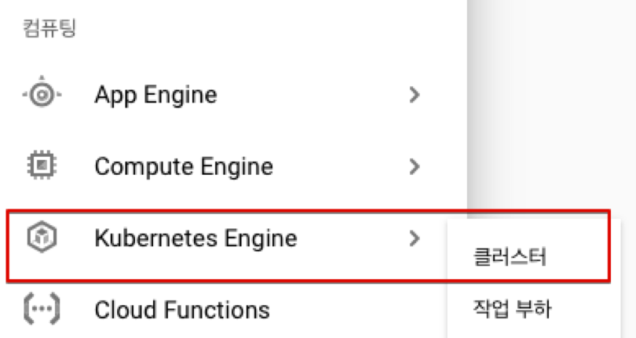
 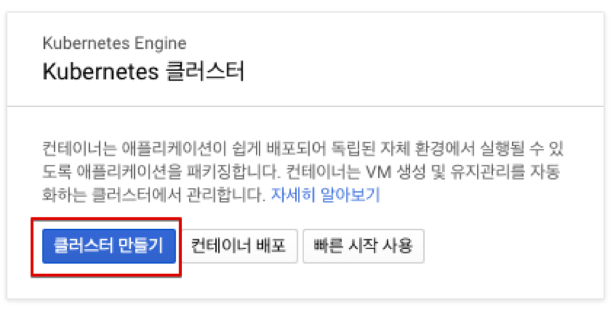
 #### 클러스터 설정
  - 표준 클러스터, 노드수 3EA
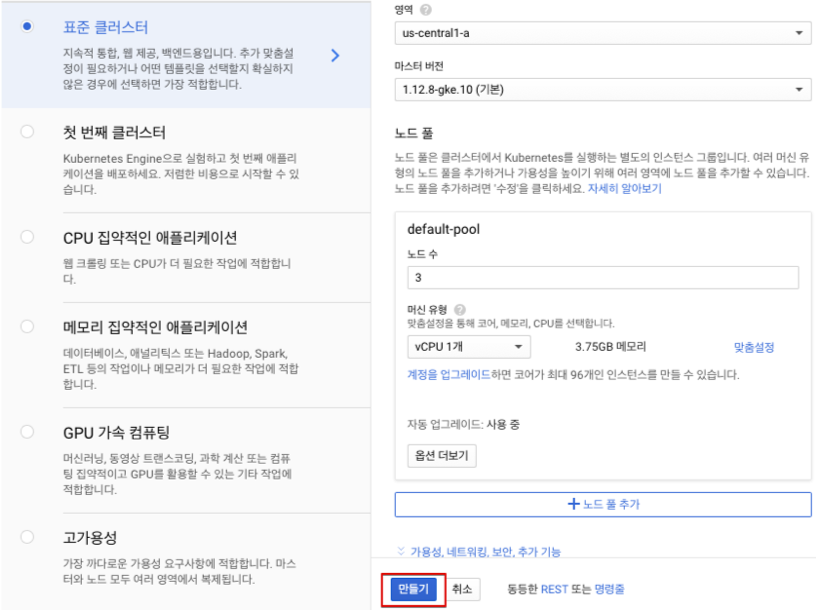
 - 콘솔 연결
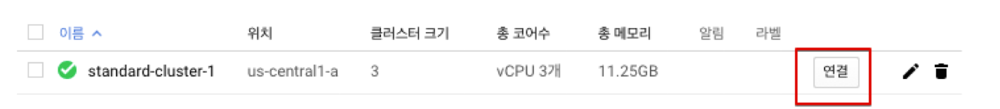

 - Cloud Shell 에서 실행 
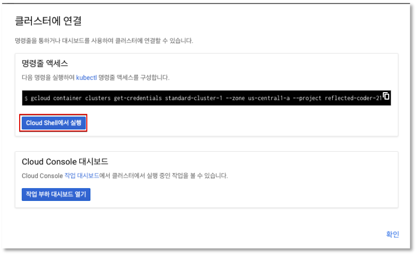

 - Cluster infomation
 ```
 $ kubectl cluster-info  
 ```
 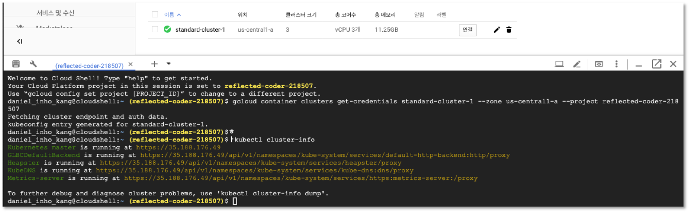

 - Node 정보 
 ```
$ kubectl get node
 ```

 ``` shell
$ kubectl describe node <nodename>  # ex) kubectl describe node gke-standard-cluster-1-default-pool-872025dc-4rch
 ```
 

 -  Tab Completion in bash (optional)
```
 $ source <(kubectl completion bash)
```
 - Application 실행
```
$ kubectl run kubia --image=luksa/kubia --port=8080 --generator=run/v1
```


 - 실행 Pod 확인
$ kubectl get pod
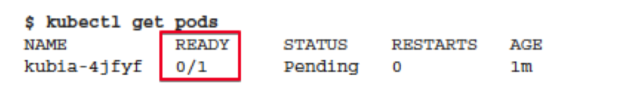
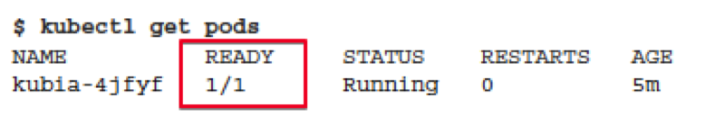

 - 서비스 생성
$ kubectl expose rc kubia --type=LoadBalancer --name kubia-http

- 서비스 상태 확인 
처음에 Pend이었다가 External-IP가 할당되는 것을 확인할 수 있다. (계속 "kubectl get svc"를 실행해서 상태 변경확인)


- 서비스 접속 확인
```
$curl 104.155.xx.xx:8080
```
- ReplicationController 확인 및 Scale Out
Replication Controller는 Pod를 복제하도록 하는 컨트롤러이다. 

```
$ kubectl get replicationcontrollers
```
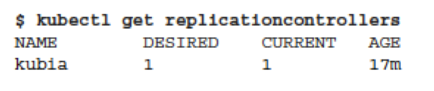
현재는 `Desired=1` 와 `Current=1` 상태이다. 

여기에 kubia pod를 3개로 늘려본다. 
```
$ kubectl scale rc kubia --replicas=3
```
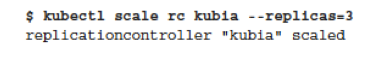

 - Scale out 확인

```
$ kubectl get rc
```


Replication Controller 의 `Desired` 와 `Current`를 확인한다.

```
$ kubectl get pods
```
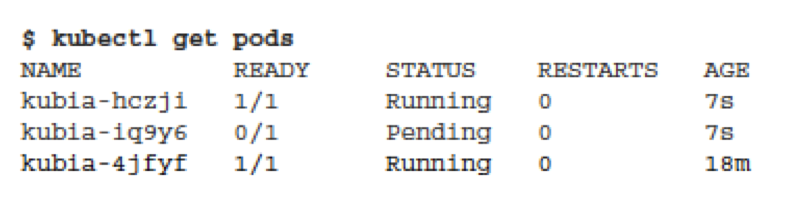
Pod가 Deploy되는 상태(`STATE`)를 관찰한다. 


- 서비스 접속 확인


