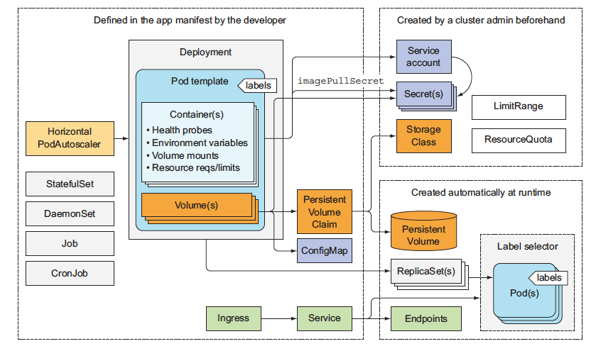

# Kubernetes Concept




## Concept 개요

쿠버네티스를 사용하려면, *쿠버네티스 API 오브젝트* 로 클러스터에 대해 사용자가 *바라는 상태(desired state)* 를 기술해야 한다. 어떤 애플리케이션이나 워크로드를 구동시키려고 하는지, 어떤 컨테이너 이미지를 쓰는지, Replicas(복제)의 수는 몇 개인지, 어떤 네트워크와 디스크 자원을 쓸 수 있도록 할 것인지 등을 의미한다. desired state를 설정하는 방법은 쿠버네티스 API를 사용해서 오브젝트를 만드는 것인데, 대개 `kubectl`이라는 커맨드라인 인터페이스를 사용한다. 클러스터와 상호 작용하고 바라는 상태를 설정하거나 수정하기 위해서 쿠버네티스 API를 직접 사용할 수도 있다.

desired state를 설정하면, *쿠버네티스 컨트롤 플레인* 은 Pod Lifecycle Event Generator (PLEG) 를 통해 클러스터의 현재 상태를 바라는 상태와 일치시킨다. 그렇게 함으로써, 쿠버네티스가 컨테이너를 시작 또는 재시작하거나, 주어진 애플리케이션의 복제 수를 스케일링하는 등의 다양한 작업을 자동으로 수행한다.

## 쿠버네티스 오브젝트

쿠버네티스는 시스템의 상태를 나타내는 추상화한 개념들 다수 포함하고 있다. 컨테이너화되어 배포된 애플리케이션과 워크로드, 이와 연관된 네트워크와 디스크 자원, 그 밖에 클러스터가 무엇을 하고 있는지에 대한 정보가 이에 해당한다. 이런 추상 개념은 쿠버네티스 API 내 오브젝트로 표현된다. 

기초적인 쿠버네티스 오브젝트에는 다음과 같은 것들이 있다.

* [파드](https://kubernetes.io/docs/concepts/workloads/pods/pod-overview/)
* [서비스](https://kubernetes.io/docs/concepts/services-networking/service/)
* [볼륨](https://kubernetes.io/docs/concepts/storage/volumes/)
* [네임스페이스](https://kubernetes.io/docs/concepts/overview/working-with-objects/namespaces/)


추가로, 쿠버네티스에는 컨트롤러라는 보다 높은 수준의 추상 개념도 다수 있다. 컨트롤러는 기초 오브젝트를 기반으로, 부가 기능 및 편의 기능을 제공해준다. 다음이 포함된다.

* [레플리카 셋](https://kubernetes.io/docs/concepts/workloads/controllers/replicaset/)
* [디플로이먼트](https://kubernetes.io/docs/concepts/workloads/controllers/deployment/)
* [스테이트풀 셋](https://kubernetes.io/docs/concepts/workloads/controllers/statefulset/)
* [데몬 셋](https://kubernetes.io/docs/concepts/workloads/controllers/daemonset/)
* [잡](https://kubernetes.io/docs/concepts/workloads/controllers/jobs-run-to-completion/)


## 쿠버네티스 오브젝트 이해하기

*쿠버네티스 오브젝트* 는 쿠버네티스 시스템에서 영속성을 가지는 개체이다(상태값이 ETCD에 저장). 쿠버네티스는 클러스터의 상태를 나타내기 위해 이 개체를 이용한다. 

* 어떤 컨테이너화된 애플리케이션이 동작 중인지 (그리고 어느 노드에서 동작 중인지)
* 그 애플리케이션이 이용할 수 있는 리소스
* 그 애플리케이션이 어떻게 재구동 정책, 업그레이드, 그리고 내고장성과 같은 것에 동작해야 하는지에 대한 정책


### 오브젝트 스펙(spec)과 상태(status)

모든 쿠버네티스 오브젝트는 오브젝트의 구성을 결정해주는 두 개의 중첩된 오브젝트 필드를 포함하는데 오브젝트 *spec* 과 오브젝트 *status* 가 그것이다. 필히 제공되어야만 하는 *spec* 은, 오브젝트가 가졌으면 하고 원하는 특징, 즉 의도한 상태를 기술한다. *status* 는 오브젝트의 *actual state* 를 기술하고, 쿠버네티스 시스템에 의해 제공되고 업데이트 된다. 쿠버네티스 컨트롤 플레인은 오브젝트의 실제 상태(actual state)를 여러분이 제시한 의도한 상태(desired state)에 일치시키기 위해 능동적으로 관리한다.


예를 들어, 쿠버네티스 디플로이먼트는 클러스터에서 동작하는 애플리케이션을 표현해 줄 수 있는 오브젝트이다. 디플로이먼트를 생성할 때, 디플로이먼트 spec에 3개의 애플리케이션 레플리카가 동작되도록 설정할 수 있다. 쿠버네티스 시스템은 그 디플로이먼트 spec을 읽어 spec에 일치되도록 상태를 업데이트하여 3개의 의도한 애플리케이션 인스턴스를 구동시킨다.


### 쿠버네티스 오브젝트 기술하기

쿠버네티스에서 오브젝트를 생성할 때, 오브젝트의 이름과 같은 기본적인 정보와 Desired state를 오브젝트 spec에 기술한다. 

`kubectl`을 이용해 YAML로 쿠버네티스 API를 호출하면 `kubectl`가 YAML을 JSON형식으로 정보를 변환해준다. 


------------------ 여기 까지만 밑의 Spec 은 실습에서 확인------------


쿠버네티스 디플로이먼트를 위한 `.yaml` 파일 예시
```yaml
apiVersion: apps/v1 # for versions before 1.9.0 use apps/v1beta2
kind: Deployment
metadata:
  name: nginx-deployment
spec:
  selector:
    matchLabels:
      app: nginx
  replicas: 2 # tells deployment to run 2 pods matching the template
  template:
    metadata:
      labels:
        app: nginx
    spec:
      containers:
      - name: nginx
        image: nginx:1.7.9
        ports:
        - containerPort: 80
```

`kubectl` 이용해 적용해 보면 

```shell
kubectl apply -f https://k8s.io/examples/application/deployment.yaml --record
```

다음과 같은 출력을 볼 수 있다. 

```shell
deployment.apps/nginx-deployment created
```

### Required Fields

생성하고자 하는 쿠버네티스 오브젝트에 대한 `.yaml` 파일 내, 다음 필드를 위한 값들을 설정해 줘야한다.

* `apiVersion` - 이 오브젝트를 생성하기 위해 사용하고 있는 쿠버네티스 API 버전이 어떤 것인지
* `kind` - 어떤 종류의 오브젝트를 생성하고자 하는지
* `metadata` - `이름` 문자열, `UID`, 그리고 선택적인 `네임스페이스` 를 포함하여 오브젝트를 유일하게 구분지어 줄 데이터

그리고 오브젝트 `spec` 필드를 제공해야 한다. 오브젝트 `spec`에 대한 정확한 포맷은 모든 쿠버네티스 오브젝트마다 다르고, 그 오브젝트 특유의 중첩된 필드를 포함한다. [Kubernetes API Reference](https://kubernetes.io/docs/reference/generated/kubernetes-api/v1.15/) 는 쿠버네티스를 이용하여 생성할 수 있는 오브젝트에 대한 모든 spec 포맷을 살펴볼 수 있도록 해준다. 

예를 들어, `파드`에 대한 `spec` 포맷은 [여기](https://kubernetes.io/docs/reference/generated/kubernetes-api/v1.15/#podspec-v1-core)에서 확인할 수 있고, `디플로이먼트`에 대한 `spec` 포맷은 [여기](https://kubernetes.io/docs/reference/generated/kubernetes-api/v1.15/#deploymentspec-v1-apps)에서 확인할 수 있다.


### Reference 
 - [Kubernetes Concept](https://kubernetes.io/ko/docs/concepts/)
