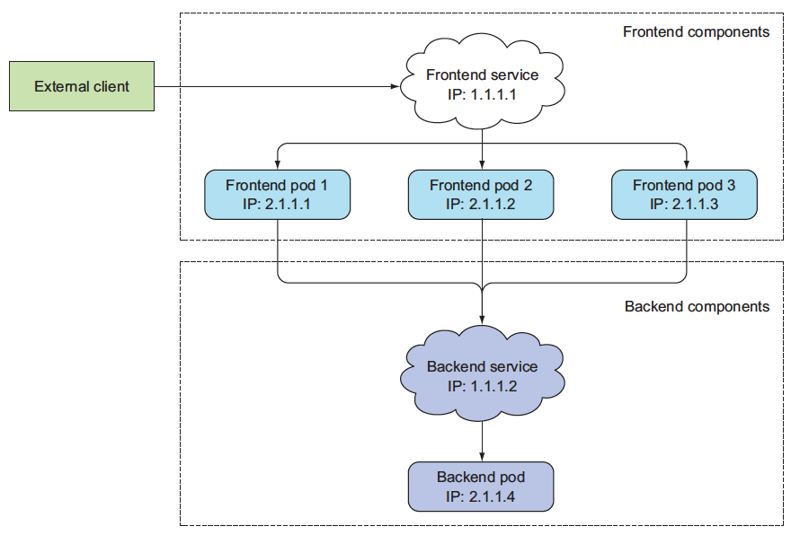
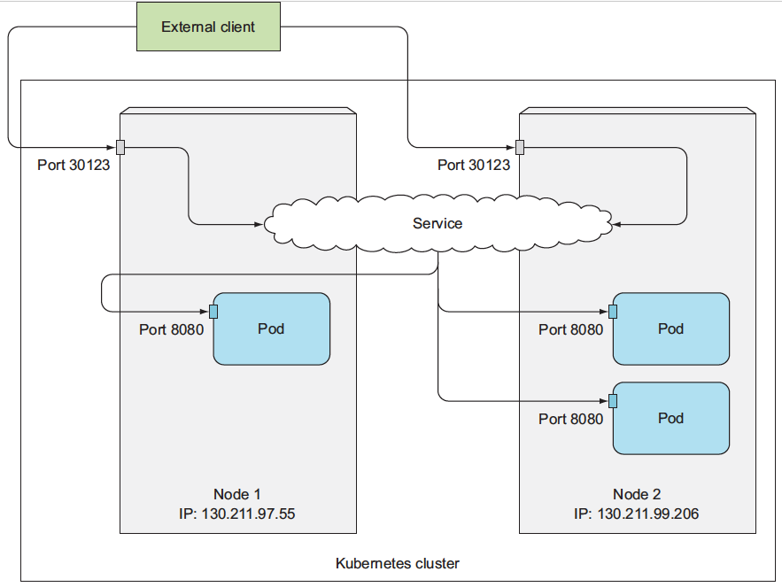
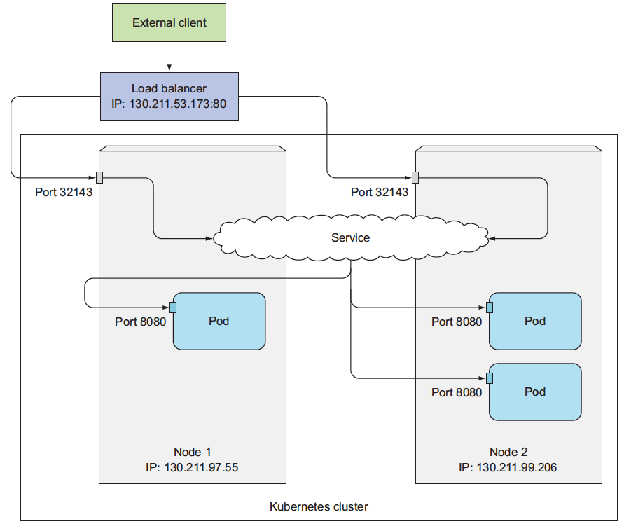
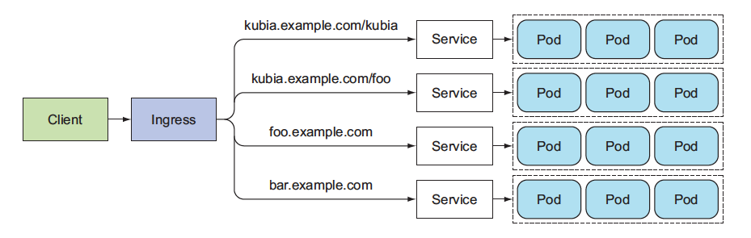
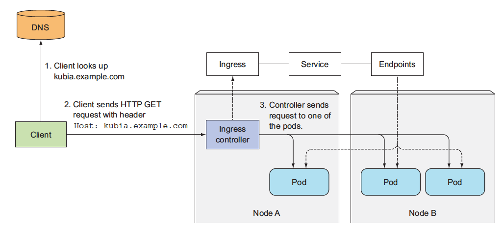

# 3. Service

## 3.1 서비스 소개
쿠버네티스 클러스터안에 컨트롤러를 이용해서 포드를 띄웠다면 이제 그 포드들에 접근하는 방법에 대해 알아본다.  
포드는 컨트롤러에 의해 관리되기 때문에 한군데에 고정되서 떠 있지 않고, 클러스터내를 옮겨다니게 된다. 이 과정에서 노드를 옮기면서 실행되기도 하고 클러스터내의 포드 IP가 변경되기도 한다. 이렇게 동적으로 변하는 포드들에 고정된 방법으로 접근하기 위해서 사용하게는 쿠버네티스의 서비스(service)이다. 서비스를 사용하게 되면 포드가 클러스터내의 어디에 있는지에 상관없이 고정된 주소를 이용해서 접근이 가능해진다. 그리고 클러스터 외부에서 포드에 접근하는것도 서비스를 통해서 가능하다. 나중에 인그레스(ingress)에 대해 알게 되면 인그레스를 통해서도 가능해 지지만 인그레스 없이도 서비스를 통해서 클러스터 외부에서 클러스터 내부의 포드로 접근하는 것이 가능하다. 




## 3.2 서비스 종류
서비스에는 크게 다음 4가지 종류가 있다. 
 - ClusterIP : 기본 서비스 타입이고 쿠버네티스 클러스터 내부에서 사용가능하다. 클러스터 내부의 노드나 포드에서 이 ClusterIP를 이용해서 이 서비스에 연결된 포드에 접속 가능하다. 클러스터 외부에서는 접근이 불가하다. 
 - NodePort : 각 노드의 지정된 포트를 할당하는 방식. node1:8080, node2:8080 이런방식으로 노드에 상관없이 포트번호만 서비스에 지정된걸 사용하면 접근이 가능하다. 노드의 포트를 사용하기 때문에 클러스터 내부 뿐만 아니라 클러스터 외부에서도 접근이 가능하다. 특이한 점은 포드가 node1에만 떠 있고 node2에는 없다고 하더라도 node2:8080으로 접근하면 node1에 떠 있는 포드로 연결이 가능합니다. 클러스터외부에서 클러스터내부의 포드로 접근할때 사용할 수 있는 가장 간단한 방법이다. 
 - LoadBalancer : AWS, GCP 같은 클라우드 서비스를 사용할때 사용가능한 옵션이다. 포드를 클라우드에서 제공해주는 로드밸런서와 연결해서 그 로드밸런서의 IP를 이용해서 클러스터 외부에서 접근이 가능하게 해준다. kubectl get service로 서비스를 확인해 봤을때 EXTERNAL-IP 부분에 로드밸런서 IP가 표시되고 이 IP를 사용하면 외부에서 접근이 가능하다. 
 - ExternalName : 서비스를 externalName의 값이랑 매치한다. 클러스터 내부에서 외부로 접근할때 주로 사용한다. 이 서비스로 접근하면 설정해둔 CNAME값으로 연결되서 클러스터 외부로 접근할 수 있다. 외부로 접근할때 사용하는 값이기 때문에 설정할때 셀렉터가 필요 없다.


## 3.4 서비스 템플릿
서비스 템플릿 기본 구조는 다음과 같다. 다른 부분은 일반적인 형태고 spec부분을 보면 spec.type으로 서비스 타입을 지정할수 있다. spec.type을 지정하지 않으면 기본 타입은 ClusterIP이다. spec.clusterIP를 이용해서 사용하려는 클러스터IP를 직접 지정하는것도 가능하다. 지정하지 않으면 자동으로 값이 할당된다. spec.selector에서는 서비스와 연결할 포드에 지정된 라벨을 지정한다. spec.ports는 배열 형태의 값이다. 서비스가 포트를 외부에 제공할때 하나가 아니라 여러개를 한꺼번에 제공가능한데 spec.ports 하위에 값을 넣어주면 된다. 

```yaml
apiVersion: v1
kind: Service
metadata:
  name: my-service
spec:
  type: ClusterIP
  ports:
  - protocol: TCP
    port: 80
    targetPort:8080    
  selector:
    app: kubia

```


## 3.6 Service 실습

### 3.6.1 서비스 생성

아래 yaml descriptor는 kubia 서비스를 정의한다. 80 포트로 서비스를 외부에 노출하고 app=kubia라는 라벨을 가진 Pod의 8080 포트로 라우팅을 한다. 
```yaml
apiVersion: v1
kind: Service
metadata:
  name: kubia
spec:
  ports:
  - port: 80
    targetPort: 8080
  selector:
    app: kubia

```


```bash
# svc 생성
$ kubectl create -f kubia-svc.yaml

# svc 확인
$ kubectl get svc
NAME       CLUSTER-IP     EXTERNAL-IP   PORT(S)   AGE
kubernetes 10.111.240.1   <none>        443/TCP   30d
kubia      10.111.249.153 <none>        80/TCP    6m
```

여기서 할당된 IP는`10.11.1249.153`로 CLUSTER-IP 이다. 이는 외부에서 접근할 수 있는 IP가 아니며, 쿠버네티스 클러스터 내부에서만 인식되는 IP이다.  

아래의 명령어를 이용해서 CLUSTER-IP Service를 호출한다. 
```bash
# 실행중인 pod에 curl 명령 실행
$ kubectl exec kubia-7nog1 -- curl -s http://10.111.249.153
You’ve hit kubia-gzwli

```


### 3.6.2 Service EndPoint 확인
 서비스는 Endpoint를 이용해서 서비스 대상 Pod의 IP:Port를 가지고 리다이렉트를 하게 된다.   
```bash
#Serivce EndPoint 확인
$ kubectl describe svc kubia
Name: kubia
Namespace: default
Labels: <none>
Selector: app=kubia
Type: ClusterIP
IP: 10.111.249.153
Port: <unset> 80/TCP
Endpoints: 10.108.1.4:8080,10.108.2.5:8080,10.108.2.6:8080
Session Affinity: None

$ kubectl get endpoints kubia
NAME  ENDPOINTS                                       AGE
kubia 10.108.1.4:8080,10.108.2.5:8080,10.108.2.6:8080 1h
```

### 3.6.3 외부 클라이언트로 서비스 연결 - NodePort

NodePort 서비스 생성

```yaml
apiVersion: v1
kind: Service
metadata:
  name: kubia-nodeport
spec:
  type: NodePort
  ports:
  - port: 80
    targetPort: 8080
    nodePort: 30123
  selector:
    app: kubia
```

```bash
# svc 생성
$ kubectl create -f kubia-svc-nodeport.yaml

# svc 확인
$ kubectl get svc kubia-nodeport
NAME            CLUSTER-IP      EXTERNAL-IP   PORT(S)       AGE
kubia-nodeport 10.111.254.223   <nodes>       80:30123/TCP  2m

```


위의 서비스에 접근하는 방법

 - 10.111.245.223:80
 - <첫번째 노드의 IP>:30123
 - <두번째 노드의 IP>:30123

```bash
#firewall rule 추가
$ gcloud compute firewall-rules create kubia-svc-rule --allow=tcp:30123
Created [https://www.googleapis.com/compute/v1/projects/kubia-
1295/global/firewalls/kubia-svc-rule].
NAME NETWORK SRC_RANGES RULES SRC_TAGS TARGET_TAGS
kubia-svc-rule default 0.0.0.0/0 tcp:30123


# 서비스 호출
$ curl http://130.211.97.55:30123
You've hit kubia-ym8or
$ curl http://130.211.99.206:30123
You've hit kubia-xueq1
```

### 3.6.5 외부 클라이언트로 서비스 연결 - LoadBalancer

클라우드 서비스등에서 제공하는 LoadBalancer를 이용한 서비스 노출

`spec.type=LoadBalancer`
```yaml
apiVersion: v1
kind: Service
metadata:
  name: kubia-loadbalancer
spec:
  type: LoadBalancer
  ports:
  - port: 80
    targetPort: 8080
  selector:
    app: kubia
```

```bash
# svc 생성
$ kubectl create -f kubia-svc-loadbalancer.yaml

# svc 확인
$ kubectl get svc kubia-loadbalancer
NAME                CLUSTER-IP      EXTERNAL-IP     PORT(S)       AGE
kubia-loadbalancer  10.111.241.153  130.211.53.173  80:32143/TCP   1m

# svc 와부 접근
$ curl http://130.211.53.173
You've hit kubia-xueq1
```




### 3.7 Ingress & Ingress Controller

인그레스(ingress)는 클러스터 외부에서 내부로 접근하는 요청들을 어떻게 처리할지 정의해둔 규칙들의 모음입니다. 외부에서 접근가능한 URL을 사용할 수 있게 하고, 트래픽 로드밸런싱도 해주고, SSL 인증서 처리도 해주고, 도메인 기반으로 가상 호스팅을 제공하기도 합니다. 인그레스 자체는 이런 규칙들을 정의해둔 자원이고 이런 규칙들을 실제로 동작하게 해주는게 인그레스 컨트롤러(ingress controller)입니다. 





클라우드 서비스를 사용하게 되면 별다른 설정없이 각 클라우드 서비스에서 자사의 로드밸런서 서비스들과 연동해서 인그레스를 사용할 수 있게 해줍니다. 클라우드 서비스를 사용하지 않고 직접 쿠버네티스 클러스터를 구축해서 사용하는 경우라면 인그레스 컨트롤러를 직접 인그레스와 연동해 주어야 합니다. 이때 가장 많이 사용되는건 쿠버네티스에서 제공하는  ingress-nginx(https://github.com/kubernetes/ingress-nginx) 입니다. 

nginx 인그레스 컨트롤러는 인그레스에 설정된 내용을 nginx 환경설정으로 변경해서 nginx에 적용합니다. 이외에도 다양한 인그레스 컨트롤러가 있습니다. 


## Chapter 2 Contents
 - ### [0. Concept](0-concept.md)
 - ### [1. POD](1-pod.md)
 - ### [2. Controller](2-controller.md)
 - ### [3. Service](3-service.md)
 - ### [4. Volume](4.volume.md)


### Reference
 - Kubernetes in Action
 - [아리수:서비스](https://arisu1000.tistory.com/27838)


