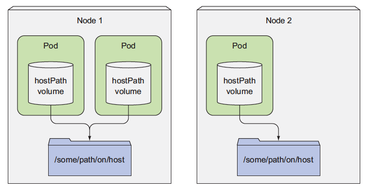
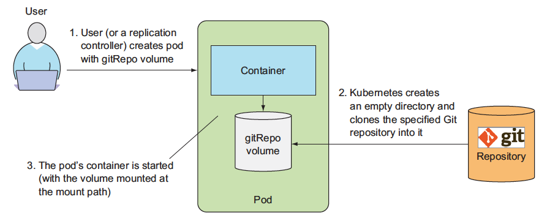
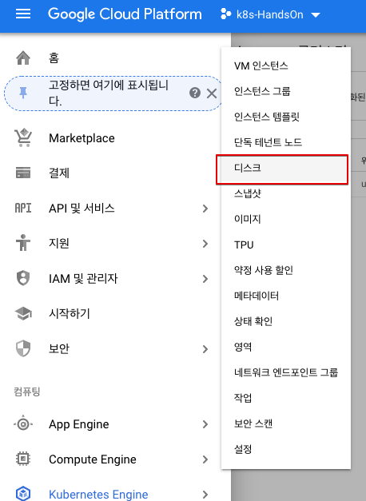
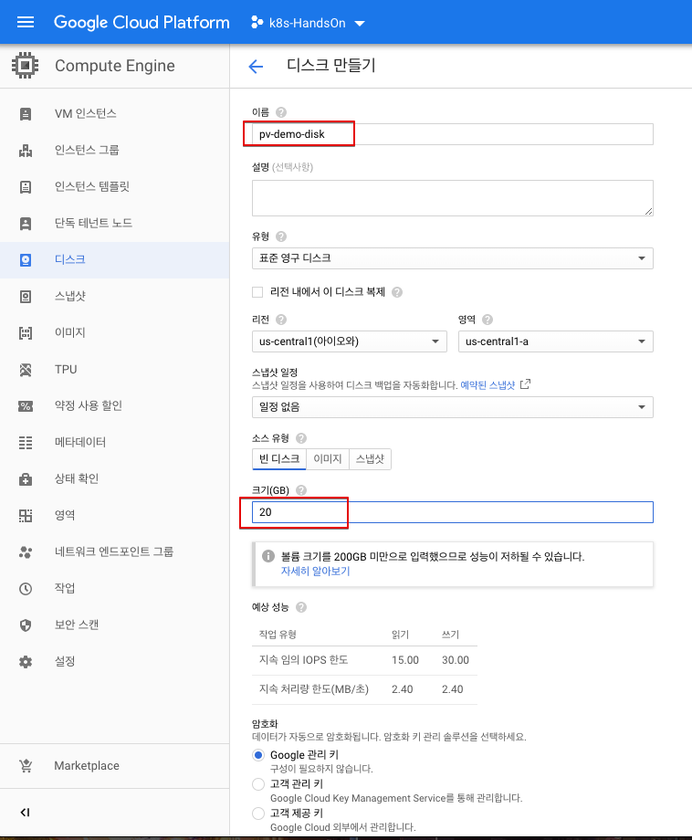

# 4. Volume

## 4.1 볼륨 소개
컨테이너는 기본적으로 상태가 없는(stateless) 앱을 사용한다. 상태가 없다는건 어떤 이유로건 컨테이너가 죽었을때 현재까지의 데이터가 사라진다는 것이다. 

상태가 없기 때문에 컨테이너에 문제가 있거나 노드에 장애가 발생해서 컨테이너를 새로 띄우거나 다른곳으로 옮기는게 자유롭다. 이것이 컨테이너의 장점입니다. 하지만 앱의 특성에 따라서 컨테이너가 죽더라도 데이터가 사라지면 안되고 보존되어야 하는 경우가 있다. 

대표적으로 정보를 파일로 기록해두는 젠킨스가 있습니다. mysql같은 데이터베이스도 컨테이너가 내려가거나 재시작했다고해서 데이터가 사라지면 안된다. 그 때 사용할 수 있는게 볼륨이다. 볼륨을 사용하게 되면 컨테이너가 재시작을 하더라도 데이터가 사라지지 않고 유지된다. 

더 나아가서 퍼시스턴스 볼륨을 사용하게 된다면 컨테이너가 재시작할때 데이터를 쌓아뒀던 노드가 아니라 다른 노드에서 실행된다고 하더라도 자동으로 데이터가 있는 볼륨이 컨테이너가 새로 시작한 노드에 옮겨 붙어서 쌓아뒀던 데이터를 그대로 활용해서 사용할 수 있다. 이런 식으로 구성하게 되면 단순히 하나의 서버에서만 데이터를 기록해두고 사용하는것 보다 더 안정적으로 서비스를 운영할 수 있게 된다. 

## 4.2 볼륨 종류
쿠버네티스의 볼륨은 여러가지 종류가 있는데,  로컬 디스크 뿐 아니라, NFS, iSCSI, Fiber Channel과 같은 일반적인 외장 디스크 인터페이스는 물론, GlusterFS나, Ceph와 같은 오픈 소스 파일 시스템, AWS EBS, GCP Persistent 디스크와 같은 퍼블릭 클라우드에서 제공되는 디스크, VsphereVolume과 같이 프라이비트 클라우드 솔루션에서 제공하는 디스크 볼륨까지 다양한 볼륨을 지원한다. 

Temp | Local | Network
:-----|:-----------|:-----------
emptyDir | hostPath | GlusterFS gitRepo NFS iSCSI gcePersistentDisk AWS EBS azureDisk Fiber Channel Secret


### 4.3 emptyDir
emptyDir은 Pod가 생성될때 생성되고, Pod가 삭제 될때 같이 삭제되는 임시 볼륨이다. 

단 Pod 내의 컨테이너 크래쉬되어 삭제되거나 재시작 되더라도 emptyDir의 생명주기는 컨테이너 단위가 아니라, Pod 단위이기 때문에, emptyDir은 삭제 되지 않고 계속해서 사용이 가능하다. 

생성 당시에는 디스크에 아무 내용이 없기 때문에, emptyDir  이라고 한다.

emptyDir의 물리적으로 노드에서 할당해주는 디스크에 저장이 되는데, (각 환경에 따라 다르다. 노드의 로컬 디스크가 될 수 도 있고, 네트워크 디스크등이 될 수 도 있다.) emptyDir.medium 필드에 “Memory”라고 지정해주면, emptyDir의 내용은 물리 디스크 대신 메모리에 저장이 된다.


#### 4.3.1 emptyDir 실습

이 예제에서는 emptyDir를 이용해서 하나의 Pod에서 컨테이너끼리 볼륨을 공유하는 기능을 실습한다. 

```yaml
apiVersion: v1
kind: Pod
metadata:
  name: fortune
spec:
  containers:
  - image: luksa/fortune
    name: html-generator
    volumeMounts:
    - name: html
      mountPath: /var/htdocs
  - image: nginx:alpine
    name: web-server
    volumeMounts:
    - name: html
      mountPath: /usr/share/nginx/html
      readOnly: true
    ports:
    - containerPort: 80
      protocol: TCP
  volumes:
  - name: html
    emptyDir: {}
```
위의 두 컨테이너중 첫번째 컨테이너는 유닉스의 10초에 한번씩 fortune 명령어를 호출해서 `/var/htdocs/index.html`파일에 기록한다(fortune 폴더의 fortuneloop.sh 참조) 그리고 volumeMount를 이용해 `html`라는 이름의 volume(emptyDir type)을 mount했다. 

두번째 컨테이너는 nginx 웹서버 컨테이너로 emptyDir의 내용을 `/usr/share/nginx/html`로 마운트해서 서비스한다. 

이 포드를 실행하면 10초마다 새로운 fortune 내용을 index.html에 기록하고 이 내용을 nginx가 서비스하게 된다.

```bash
#pod 생성
$ kubectl create -f https://raw.githubusercontent.com/DannyKang/k8s-Workshop/master/chapter2/fortune-pod.yaml

#포트 포워딩 - 로컬 컴퓨터의 포트 8080을 통해서 nginx 서버에 액세스할 수 있다.
$ kubectl port-forward fortune 8080:80

#nginx 접속
$ curl http://localhost:8080
Beware of a tall blond man with one black shoe.
```


### 4.4 hostPath 볼륨

다음은 hostPath 라는 볼륨 타입인데, hostPath는 노드의 로컬 디스크의 경로를 Pod에서 마운트해서 사용한다. 같은 hostPath에 있는 볼륨은 여러 Pod 사이에서 공유되어 사용된다. 

또한  Pod가 삭제 되더라도 hostPath에 있는 파일들은 삭제되지 않고 다른 Pod가 같은 hostPath를 마운트하게 되면, 남아 있는 파일을 액세스할 수 있다. 


주의할점 중의 하나는 Pod가 재시작되서 다른 노드에서 기동될 경우, 그 노드의 hostPath를 사용하기 때문에, 이전에 다른 노드에서 사용한 hostPath의 파일 내용은 액세스가 불가능하다. 

hostPath는 노드의 파일 시스템을 접근하는데 유용한데, 예를 들어 노드의 로그 파일을 읽어서 수집하는 로그 에이전트를 Pod로 배포하였을 경우, 이 Pod에서 노드의 파일 시스템을 접근해야 한다. 이러한 경우에 유용하게 사용할 수 있다. 


### 4.5 gitRepo
볼륨 타입중에 gitRepo라는 유용한 볼륨 타입이 하나 있어서 소개한다.

이 볼륨은 생성시에 지정된 git 리파지토리의 특정 리비전의 내용을 clone을 이용해서 내려 받은후에 디스크 볼륨을 생성하는 방식이다. 물리적으로는 emptyDir이 생성되고, git 레파지토리 내용을 clone으로 다운 받는다.

HTML과 같은 정적 파일이나 Ruby on rails, PHP, node.js 와 같은 스크립트 언어 기반의 코드들은 gitRepo 볼륨을 이용하여 손쉽게 배포할 수 있다.





## 4.6 퍼시스턴트볼륨(PersistentVolume, PV)과 퍼시스턴트볼륨클레임(PersistentVolumeClaim)

일반적으로 디스크 볼륨을 설정하려면 물리적 디스크를 생성해야 하고, 이러한 물리적 디스크에 대한 설정을 자세하게 이해할 필요가 있다.

쿠버네티스는 인프라에 대한 복잡성을 추상화를 통해서 간단하게 하고, 개발자들이 손쉽게 필요한 인프라 (컨테이너,디스크, 네트워크)를 설정할 수 있도록 하는 개념을 가지고 있다

그래서 인프라에 종속적인 부분은 시스템 관리자가 설정하도록 하고, 개발자는 이에 대한 이해 없이 간단하게 사용할 수 있도록 디스크 볼륨 부분에 PersistentVolumeClaim (이하 PVC)와 PersistentVolume (이하 PV)라는 개념을 도입하였다.


시스템 관리자가 실제 물리 디스크를 생성한 후에, 이 디스크를 PersistentVolume이라는 이름으로 쿠버네티스에 등록한다.

 개발자는 Pod를 생성할때, 볼륨을 정의하고, 이 볼륨 정의 부분에 물리적 디스크에 대한 특성을 정의하는 것이 아니라 PVC를 지정하여, 관리자가 생성한 PV와 연결한다.

> **Persistent Volume**(이하 PV) 는 Kubernetes 에서 관리되는 저장소로 Pod 과는 다른 수명 주기로 관리됩니다.   
Pod 이 재실행 되더라도, PV의 데이터는 정책에 따라 **유지/삭제**가 됩니다.   
   
> **Persistent Volume Claim**(이하 PVC) 는 PV를 추상화하여 개발자가 손쉽게 PV를 사용 가능하게 만들어주는 기능입니다.   
개발자는 사용에 필요한 Volume의 크기, Volume의 정책을 선택하고 요청만 하면 됩니다.   
운영자는 개발자의 요청에 맞게 PV 를 생성하게 되고, PVC는 해당 PV를 가져가게 됩니다.   
   
   

시스템 관리자가 생성한 물리 디스크를 쿠버네티스 클러스터에 표현한것이 PV이고, Pod의 볼륨과 이 PV를 연결하는 관계가 PVC가 된다. 

이와 같은 방식을 **Static Provisioning** 이라 합니다.   
예제를 통해 Static Provisioning을 확인 해보겠습니다. 


### 4.6.1 Static Provisioning


### **NFS**
NFS 서버를 PV로 사용하는 방식입니다.   
예제에 활용될 yaml 파일 내용은 아래와 같습니다.   
~~~yaml   
[root@m01 pod-example]# cat nfs-pod.yml
apiVersion: v1
kind: Pod
metadata:
  name: nfs-nginx
spec:
  containers:
  - name: nginx
    image: nginx
    volumeMounts:
    - name: nfsvol
      mountPath: /usr/share/nginx/html
  volumes:
  - name : nfsvol
    nfs:
      path: /data/nfs-ngnix
      server: 192.168.13.10
~~~   
위 yaml 파일을 이용해 Pod 을 생성하면   
~~~sh   
[root@m01 pod-example]# kubectl describe po nfs-nginx
Name:               nfs-nginx
Namespace:          default
Priority:           0
PriorityClassName:  <none>
Node:               w03/192.168.13.16
Start Time:         Sun, 14 Apr 2019 13:44:52 +0900
Labels:             <none>
Annotations:        <none>
Status:             Running
IP:                 10.233.89.5
Containers:
  nginx:
    Container ID:   docker://20fa842803535803e1c0c48c204cffe1d464f9f96e3fcf4d7eed11c0bb8aeed0
    Image:          nginx
    Image ID:       docker-pullable://nginx@sha256:50174b19828157e94f8273e3991026dc7854ec7dd2bbb33e7d3bd91f0a4b333d
    Port:           <none>
    Host Port:      <none>
    State:          Running
      Started:      Sun, 14 Apr 2019 13:45:13 +0900
    Ready:          True
    Restart Count:  0
    Environment:    <none>
    Mounts:
      /usr/share/nginx/html from nfsvol (rw)
      /var/run/secrets/kubernetes.io/serviceaccount from default-token-9vmtn (ro)
Conditions:
  Type              Status
  Initialized       True
  Ready             True
  ContainersReady   True
  PodScheduled      True
Volumes:
  nfsvol:
    Type:      NFS (an NFS mount that lasts the lifetime of a pod)
    Server:    192.168.13.10
    Path:      /data/nfs-ngnix
    ReadOnly:  false
  default-token-9vmtn:
    Type:        Secret (a volume populated by a Secret)
    SecretName:  default-token-9vmtn
    Optional:    false
QoS Class:       BestEffort
Node-Selectors:  <none>
Tolerations:     node.kubernetes.io/not-ready:NoExecute for 300s
                 node.kubernetes.io/unreachable:NoExecute for 300s
Events:
  Type    Reason     Age   From               Message
  ----    ------     ----  ----               -------
  Normal  Scheduled  50s   default-scheduler  Successfully assigned default/nfs-nginx to w03
  Normal  Pulling    46s   kubelet, w03       pulling image "nginx"
  Normal  Pulled     28s   kubelet, w03       Successfully pulled image "nginx"
  Normal  Created    28s   kubelet, w03       Created container
  Normal  Started    28s   kubelet, w03       Started container
~~~   
nfs-nginx 라는 Pod 이 생성이 되고 위와 같이 **nfsvol** 이라는 Volume 이 Attach 된 것을 확인 할 수 있습니다.   
nginx 서비스가 연결된 Volume 을 통해 서비스가 되는지 확인해봅니다.  
~~~sh
[root@m01 pod-example]# curl 10.233.89.5
<html>
<body>
<p>NFS Index-v1</p>
</body>
</html>
[root@m01 pod-example]#

# Pod 내부에 접근해서 확인
[root@m01 pod-example]# kubectl exec -ti nfs-nginx /bin/bash
root@nfs-nginx:/#
root@nfs-nginx:/# cd /usr/share/nginx/html/
root@nfs-nginx:/usr/share/nginx/html# cat index.html
<html>
<body>
<p>NFS Index-v1</p>
</body>
</html>
root@nfs-nginx:/usr/share/nginx/html#
~~~   
**NFS Index-v1** 라는 index.html 을 가지고 있는 Volume 입니다.   
NFS 서버에 직접 접근해서 index.html 파일을 수정해보겠습니다.   
~~~sh   
[root@kube-depoly nfs-ngnix]# pwd
/data/nfs-ngnix
[root@kube-depoly nfs-ngnix]# cat index.html
<html>
<body>
<p>NFS Index-v1</p>
</body>
</html>
[root@kube-depoly nfs-ngnix]# vi index.html        // index.html 수정
[root@kube-depoly nfs-ngnix]# cat index.html
<html>
<body>
<p>NFS Index-v2</p>
</body>
</html>
[root@kube-depoly nfs-ngnix]#

# 적용 확인
[root@m01 pod-example]# curl 10.233.89.5
<html>
<body>
<p>NFS Index-v2</p>
</body>
</html>
[root@m01 pod-example]#
~~~   
이와 같이 Pod 에 NFS 서버가 연결 되어 있는 것을 확인 할 수 있었습니다.   
~~~sh
# NFS 로 Volume Attach 되어 있음
root@nfs-nginx:/usr/share/nginx/html# mount | grep nfs
192.168.13.10:/data/nfs-ngnix on /usr/share/nginx/html type nfs4 (rw,relatime,vers=4.1,rsize=262144,wsize=262144,namlen=255,hard,proto=tcp,timeo=600,retrans=2,sec=sys,clientaddr=192.168.13.15,local_lock=none,addr=192.168.13.10)
root@nfs-nginx:/usr/share/nginx/html#
~~~   
   

### 4.6.12 Dynamic Provisioning**

Dynamic Provisioning는 PVC를 통해 요청하는 PV대해 동적으로 생성을 해주는 제공 방식을 말합니다.   
개발자는 StorageClass 를 통해 필요한 Storage Type을 지정하여 동적으로 할당을 받을 수 있습니다. 

## 4.7 PV/PVC 실습

그러면 예제를 통해서 PV를 생성하고, 이 PV를 PVC에 연결한후에, PVC를 Pod에 할당하여 사용하는 방법을 살펴보도록 하자. 

### 4.7.1 물리 디스크 생성

먼저 구글 클라우드 콘솔에서 Compute Engine 부분에서 아래와 같이 Disks 부분에서 물리 디스크를 생성한다.



디스크를 pv-demo-disk라는 이름으로 생성하였다. 
이때 주의할점은 디스크의 region과 zone이 쿠베네티스 클러스터가 배포된 region과 zone에 동일해야 한다. 

### 4.7.2.생성된 디스크로 PV를 선언 
생성된 디스크를 이용하여 PV를 생성한다. 아래는 PV를 생성하기 위한 yaml 파일이다. 

```yaml
apiVersion: v1
kind: PersistentVolume
metadata:
  name: mongodb-pv
spec:
  capacity: 
    storage: 1Gi
  accessModes:
    - ReadWriteOnce
    - ReadOnlyMany
  persistentVolumeReclaimPolicy: Retain
  gcePersistentDisk:
    pdName: pv-demo-disk
    fsType: ext4
```

```bash
# pv 생성
$ kubectl create -f https://raw.githubusercontent.com/DannyKang/k8s-Workshop/master/chapter2/mongodb-pv-gcepd.yaml

# pv 생성 확인
$ kubectl get pv
NAME        CAPACITY    RECLAIMPOLICY   ACCESSMODES STATUS    CLAIM
mongodb-pv  1Gi         Retain          RWO,ROX     Available
```

 - PVC 생성

```yaml
apiVersion: v1
kind: PersistentVolumeClaim
metadata:
  name: mongodb-pvc 
spec:
  resources:
    requests:
      storage: 1Gi
  accessModes:
  - ReadWriteOnce
  storageClassName: "" 
```


```bash
#pvc 생성
$ kubectl create -f https://raw.githubusercontent.com/DannyKang/k8s-Workshop/master/chapter2/mongodb-pvc.yaml

#pvc 생성 확인
$ kubectl get pvc
NAME        STATUS  VOLUME      CAPACITY  ACCESSMODES AGE
mongodb-pvc Bound   mongodb-pv  1Gi       RWO,ROX     3s
```

- 포드 안에서 PVC 사용

```yaml 
apiVersion: v1
kind: Pod
metadata:
  name: mongodb 
spec:
  containers:
  - image: mongo
    name: mongodb
    volumeMounts:
    - name: mongodb-data
      mountPath: /data/db
    ports:
    - containerPort: 27017
      protocol: TCP
  volumes:
  - name: mongodb-data
    persistentVolumeClaim:
      claimName: mongodb-pvc
```

```bash
#pvc 생성
$ kubectl create -f https://raw.githubusercontent.com/DannyKang/k8s-Workshop/master/chapter2/mongodb-pod-pvc.yaml

#mongodb 접속 확인
$ kubectl exec -it mongodb mongo
MongoDB shell version: 3.2.8
connecting to: mongodb://127.0.0.1:27017
Welcome to the MongoDB shell.
...
> use mystore
switched to db mystore
> db.foo.find()
{ "_id" : ObjectId("57a61eb9de0cfd512374cc75"), "name" : "foo" }
```

### 4.7.3. Dynamic Provisioning

StorageClass를 선언해서 동적으로 Volume을 할당 받도록 한다. 
```yaml
apiVersion: storage.k8s.io/v1
kind: StorageClass
metadata:
  name: fast
provisioner: kubernetes.io/gce-pd
parameters:
  type: pd-ssd

```

```yaml
apiVersion: v1
kind: PersistentVolumeClaim
metadata:
  name: mongodb-pvc 
spec:
  storageClassName: fast
  resources:
    requests:
      storage: 100Mi
  accessModes:
    - ReadWriteOnce
```

```bash
# GCE를 사용하도록 Storage Class 적용
$ kubectl create -f https://raw.githubusercontent.com/DannyKang/k8s-Workshop/master/chapter2/storageclass-fast-gcepd.yaml

# PVC : storageClassName: fast
$ kubectl create -f https://raw.githubusercontent.com/DannyKang/k8s-Workshop/master/chapter2/mongodb-pvc-dp.yaml

# pvc 조회
$ kubectl get pvc mongodb-pvc
NAME        STATUS  VOLUME        CAPACITY  ACCESSMODES STORAGECLASS
mongodb-pvc Bound   pvc-1e6bc048  1Gi       RWO         fast

# pv확인
$ kubectl get pv
NAME          CAPACITY  ACCESSMODES   RECLAIMPOLICY STATUS    STORAGECLASS
mongodb-pv    1Gi       RWO,ROX       Retain        Released
pvc-1e6bc048  1Gi       RWO Delete    Bound                   fast

$ gcloud compute disks list
NAME                       ZONE             SIZE_GB   TYPE        STATUS
gke-kubia-dyn-pvc-1e6bc048 europe-west1-d     1       pd-ssd      READY
gke-kubia-default-pool-71df europe-west1-d   100      pd-standard READY
gke-kubia-default-pool-79cd europe-west1-d   100      pd-standard READY
gke-kubia-default-pool-blc4 europe-west1-d    100     pd-standard READY
mongodb europe-west1-d 1 pd-standard READY
```

### Reference
 - Kubernetest in Action
 - [아리수](https://arisu1000.tistory.com/27849?category=787056)
 - [조대협의 블로그](https://bcho.tistory.com/1259) 
